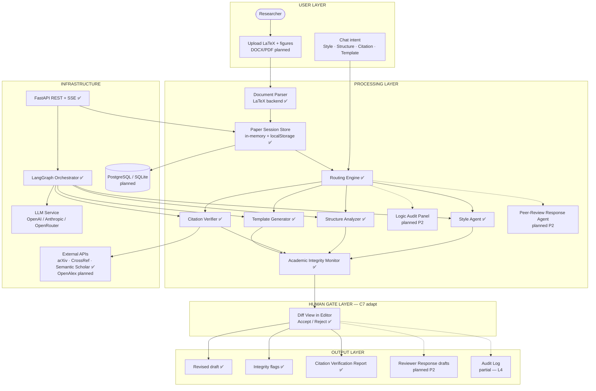
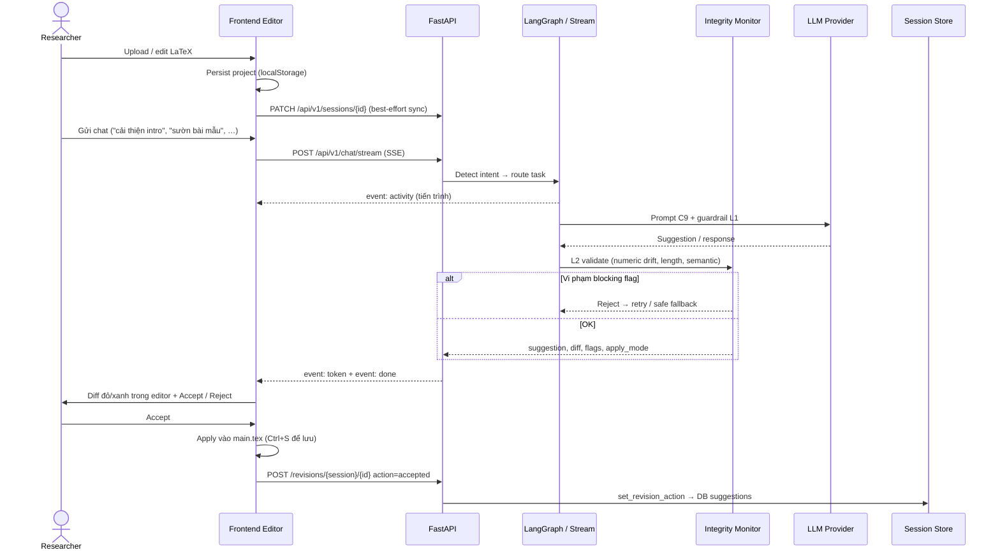
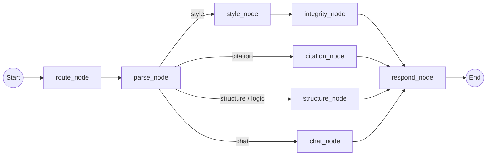
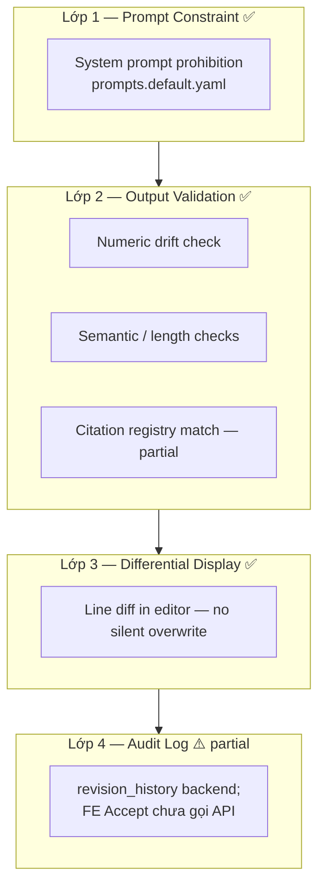
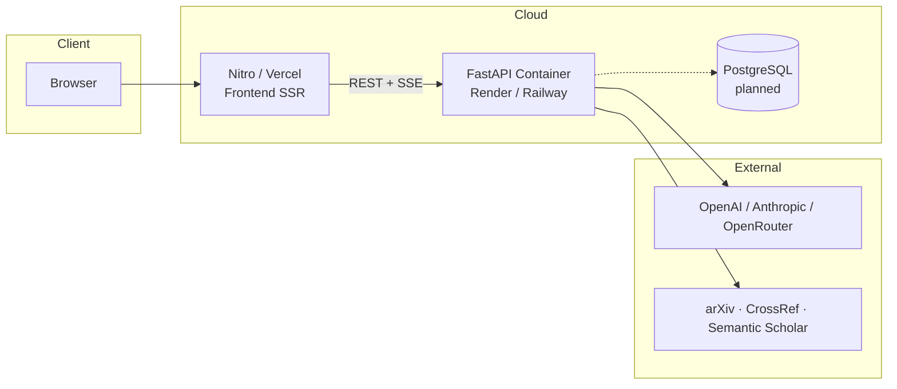

# Architecture Document — Arionear

**Dự án:** Arionear · AI Trợ Lý Viết & Biên Tập Bài Báo Khoa Học  
**Tagline:** *Closer to Publication*  
**Phiên bản tài liệu:** 2.1 · **Cập nhật:** 13/06/2026

> Kiến trúc dựa trên phân tích [AutoResearchReferee.md](./AutoResearchReferee.md) (ARC v0.3.1) — chọn lọc ~40% thành phần ARC, loại bỏ pipeline sinh bài tự động.

Tài liệu này mô tả **kiến trúc mục tiêu** và **trạng thái triển khai Phase 1 MVP** (đã code). Các mục đánh dấu *(planned)* chưa có trong repo.

---

## 1. Tóm tắt hệ thống

Arionear là nền tảng **Assisted Editing** giúp nhà nghiên cứu cải thiện bản thảo học thuật mà **không thay đổi ý nghĩa khoa học** và **không bịa dữ liệu**.

| Khía cạnh | Mô tả |
|-----------|--------|
| **Input** | Bản thảo LaTeX có sẵn *(DOCX/PDF parser — planned)* |
| **Output** | Bản thảo cải thiện + báo cáo integrity/citation + gợi ý cấu trúc |
| **Vai trò AI** | Editor (Ario) — human luôn approve cuối |
| **Khác ARC** | ARC sinh bài từ ý tưởng; Arionear **không** chạy thí nghiệm, **không** PIVOT hướng nghiên cứu |

**Stack hiện tại:**

| Layer | Công nghệ |
|-------|-----------|
| Frontend | TanStack Start, React 19, shadcn/ui, Tailwind v4, Bun |
| Backend | FastAPI, Python 3.11+, LangGraph |
| LLM | OpenAI · Anthropic · OpenRouter (chọn trong editor hoặc `.env`) |
| Session store | localStorage (frontend) + in-memory API (backend) |
| Database *(planned)* | SQLite dev → PostgreSQL prod |
| DevOps | Docker, GitHub Actions (`.github/workflows/ci.yml`), AI Usage Logging hooks (`.cursor/hooks.json`) |

---

## 2. Kiến trúc tổng thể (4 tầng)

Sơ đồ dưới đây gồm cả thành phần **đã triển khai** (Phase 1) và **mục tiêu** *(planned — in nghiêng trong mermaid label)*.



---

## 3. Luồng người dùng end-to-end

Luồng chính qua **SSE streaming** (`POST /api/v1/chat/stream`). Template IMRAD chạy qua stream path; sync `/chat` dùng LangGraph graph.



---

## 4. Thành phần chi tiết

### 4.1 Frontend (TanStack Start)

| Route | Chức năng | Trạng thái |
|-------|-----------|------------|
| `/` | Landing editorial | ✅ |
| `/projects` | Quản lý dự án | ✅ Postgres papers API |
| `/editor` | LaTeX editor + PDF preview + chat Ario | ✅ |
| `/profile` | Researcher profile & preferences | ✅ |
| `/signin`, `/signup` | Auth JWT | ✅ |

**Editor (`/editor`) — đã triển khai:**

| Tính năng | File / module |
|-----------|---------------|
| LaTeX editor + line gutter | `routes/editor.tsx` → `LatexEditor` |
| Diff đỏ/xanh trong editor | `components/latex-diff-editor.tsx`, `lib/text-diff.ts` |
| Accept / Reject + L4 audit (`revisionAction`) | `editor.tsx` → `revisionAction()` |
| Revision history panel | Tools → Versions tab, `GET /sessions/{id}/revisions` |
| Citation registry reload | `fetchCitationRegistry()` on project open |
| Chat streaming (activity, token, done + `revision_id`) | `lib/api/academic.ts` → `streamChat()` |
| Citation verify panel | Tools tab → `verifyCitations()` |
| Provider / model picker | Chat dock |
| Ctrl+S lưu + dirty `*` indicator | `project-store.ts` |
| Session sync API | `syncSession()` (best-effort) |

**Planned (P2):** DOCX/PDF upload & parse, logic audit UI, peer-review reply UI.

### 4.2 Backend (FastAPI)

Prefix: `/api/v1` · Health: `GET /health`

| Endpoint | Mục đích | Trạng thái |
|----------|----------|------------|
| `GET /status` | Agent name, provider, storage mode | ✅ |
| `GET /providers` | LLM providers & models | ✅ |
| `POST /sessions` | Tạo session | ✅ |
| `GET /sessions/{id}` | Lấy session | ✅ |
| `PATCH /sessions/{id}` | Cập nhật latex/metadata | ✅ |
| `POST /chat` | Chat sync (LangGraph) | ✅ |
| `POST /chat/stream` | Chat SSE (intent + template) | ✅ |
| `POST /edit/style` | Style edit trực tiếp | ✅ |
| `POST /citations/verify` | Xác minh trích dẫn | ✅ |
| `POST /revisions/{session_id}/{revision_id}` | Ghi accept/reject revision | ✅ |
| `GET /sessions/{session_id}/revisions` | Lịch sử AI revision | ✅ |
| `GET /sessions/{session_id}/citations` | Citation registry đã verify | ✅ |
| `GET/PATCH /users/me/profile` | Researcher profile & preferences | ✅ |
| `POST /papers`, `GET/PATCH/DELETE /papers/{id}` | Auth papers CRUD | ✅ |

### 4.3 LangGraph Orchestrator

**Topology mục tiêu:** Orchestrator → specialized sub-agents (không peer-to-peer, theo ARC).

**Đã triển khai** (`src/agents/graph.py`):



| Node | Chức năng |
|------|-----------|
| `route_node` | Regex intent: style, structure, citation, template, chat |
| `parse_node` | Parse LaTeX sections, cite keys, BibTeX; sync session |
| `style_node` | LLM polish + L2 retry (`max_style_retries`) |
| `integrity_node` | Merge integrity flags sau style |
| `citation_node` | 4-layer verify → `citation_registry` |
| `structure_node` | Rule-based + LLM structure suggestions |
| `chat_node` | General Ario chat; auto style nếu có selection |
| `respond_node` | Format response message |

**Ngoài graph:** `chat_stream.py` xử lý SSE, reasoning stream, và task **`template`** (IMRAD skeleton qua `template_latex.py`) — chưa có node riêng trong graph sync.

**Planned (P2):** `logic` → Logic Audit Panel, `review` → Peer-Review Response Agent.

### 4.4 Paper Session Store (C10 adapt)

**Hiện tại** (`src/services/sessions.py` — in-memory):

```json
{
  "id": "uuid",
  "name": "Untitled",
  "latex_content": "...",
  "metadata": {},
  "citation_registry": [{ "key", "status", "layers", "metadata", "message" }],
  "revision_history": [
    { "id", "section", "original", "suggestion", "action": "pending|accepted|rejected", "created_at" }
  ],
  "created_at": "...",
  "updated_at": "..."
}
```

Frontend lưu project riêng trong **localStorage** (`lib/project-store.ts`); `syncSession()` đồng bộ latex lên API khi mở/lưu editor.

**Schema mục tiêu (planned):** thêm `peer_review_log`, `parsed_structure` persist, `integrity_flags` theo session, PostgreSQL persistence.

### 4.5 External integrations

| Dịch vụ | Mục đích | Trạng thái |
|---------|----------|------------|
| OpenAI / Anthropic / OpenRouter | LLM inference | ✅ |
| arXiv API | Verify preprint ID | ✅ |
| CrossRef | Verify DOI metadata | ✅ |
| Semantic Scholar | Title search fallback | ✅ |
| OpenAlex | Literature suggest / validate | Planned P2 |
| DataCite | DOI metadata (bổ sung) | Planned P2 |
| LangSmith | Tracing (BTC deliverable) | Optional (`.env`) |

Citation verifier: arXiv → CrossRef → Semantic Scholar (`src/services/citations/verifier.py`).

---

## 5. Guardrail Architecture (4 lớp)

Yếu tố khác biệt cốt lõi so với editor AI thông thường.



| Lớp | Cơ chế | Trạng thái |
|-----|--------|------------|
| L1 | `src/prompts/prompts.default.yaml` — cấm thêm số liệu/claim/citation | ✅ |
| L2 | `check_integrity()` + retry trong `style_node` | ✅ |
| L3 | `LatexDiffEditor` + Accept/Reject; blocking flags disable Accept | ✅ |
| L4 | `add_revision()` backend; export AI Contribution Report | ⚠️ Partial |

---

## 6. Ánh xạ AutoResearchReferee → Arionear

| ARC | Quyết định | Arionear equivalent | Trạng thái |
|-----|------------|---------------------|------------|
| C1 RAG | ADAPT | Citation Verifier (+ Literature Suggester opt-in) | Verifier ✅ |
| C2 Debate | ADAPT | Logic Audit Panel, Review Response agents | P2 |
| C3 Sandbox | **DROP** | — | — |
| C4 Citation | ADOPT | 4-layer verifier (layers 1–3 deterministic) | ✅ |
| C5 Sentinel | ADAPT | Academic Integrity Monitor | ✅ L2 |
| C6 PIVOT | **DROP** | Revision Control (accept/reject) | ✅ UI |
| C7 HITL | ADAPT | Gate mọi LLM output qua diff | ✅ |
| C8 MetaClaw | Deferred P3 | Meta-patterns only | — |
| C9 Prompts YAML | ADOPT | `prompts.default.yaml` | ✅ |
| C10 KB | ADAPT | Paper Session Store | ✅ in-memory |

Chi tiết: [AutoResearchReferee.md](./AutoResearchReferee.md) §3–4.

---

## 7. Data flow theo tính năng

### Style & Grammar ✅

Selection / section text → Style Agent (C9) → L2 `check_integrity` → unified diff → Human gate → apply local (+ `revision_history` backend khi qua style API).

### IMRAD Template ✅

Chat "sườn bài mẫu" → `generate_template()` → full-document diff (`apply_mode: document`) → Human gate.

### Citation Validation ✅

Cite keys + BibTeX → layers arXiv / CrossRef / Semantic Scholar → status report trong Tools panel. LLM relevance (layer 4) — planned P2.

### Structure Analysis ✅

Parsed sections → rule checks + LLM JSON suggestions → chat response (chưa auto-apply diff).

### Logic Check *(P2)*

Full draft → 3 agents debate (chỉ comment) → Conflict Report.

### Peer-Review Response *(P2)*

Comments + draft → classify Major/Minor/Reject → response draft → Human gate.

---

## 8. Deployment Architecture



**Dev:**

```powershell
# Backend
uvicorn src.main:app --reload --port 8000

# Frontend
cd frontend && bun run dev
```

**Docker:** `docker-compose.yml` — backend only; frontend container planned.

---

## 9. Security & Privacy

- API keys trong `.env` — never commit
- Pydantic validation mọi API input
- CORS: explicit origins + regex `localhost` any port (dev mode)
- *Planned:* JWT auth, encryption at rest, zero-retention LLM mode cho unpublished manuscripts
- Prompt injection mitigation: user LaTeX trong HumanMessage, system prompt tách biệt (C9)

---

## 10. Design Decisions

| Decision | Choice | Reason |
|----------|--------|--------|
| Triết lý sản phẩm | Assisted Editing | Khác ARC; researcher giữ quyền sáng tạo |
| Frontend | TanStack Start | SSR + file routing; đã build editor |
| Backend | FastAPI | Async, OpenAPI, SSE streaming |
| Agent | LangGraph + stream service | Routing multi-task; template ngoài graph |
| LLM (dev) | OpenRouter (có thể free tier) | Chi phí thấp; hỗ trợ đa provider |
| Citation format | Citation.js / Pybtex *(planned)* | Deterministic — không tin LLM cho format rules |
| Human gate | Line diff + explicit accept | "Show, Don't Overwrite" (C7) |
| Experiment code | Không tích hợp | Tránh fabrication (C3 DROP) |
| Prompts | External YAML (C9) | Audit, A/B test, không redeploy |
| Session persistence | localStorage + in-memory API | MVP nhanh; DB do teammate Phase 2 |

---

## 11. Trạng thái triển khai vs kiến trúc mục tiêu

| Thành phần | Hiện tại (Phase 1 MVP) | Target |
|------------|------------------------|--------|
| Document Parser | LaTeX backend (`parser/latex.py`) | + DOCX/PDF adapters |
| Paper Session Store | localStorage + in-memory API | PostgreSQL |
| Routing Engine | Regex intent + LangGraph conditional edges | + LLM classifier |
| Style Agent | LLM + L2 retry | ✅ stable |
| Template Generator | IMRAD skeleton (`template_latex.py`) | Journal-specific templates |
| Structure Analyzer | Rules + LLM suggestions | Auto-apply optional diff |
| Citation Verifier | arXiv → CrossRef → Semantic Scholar | + OpenAlex, L4 LLM relevance |
| Human Gate diff | Line diff in editor + Accept/Reject | + Modify inline |
| Logic / Review agents | — | P2 |
| Integrity Monitor | `check_integrity()` + UI flags | + semantic model scoring |
| Guardrail L1–L3 | ✅ | L4 full audit + export report |
| Chat streaming | SSE activity/reasoning/token | ✅ |
| Auth | Mock UI | JWT / real auth |

---

## 12. Roadmap (tóm tắt)

| Phase | Trọng tâm |
|-------|-----------|
| **P1 MVP** *(đang chạy)* | Style, structure, citation, template, diff gate, streaming — **phần lớn ✅** |
| **P1.5** | ✅ L4 audit, revision/citation persistence, researcher profile |
| **P2** | Logic audit panel, peer-review response, OpenAlex, DOCX/PDF import |
| **P3** | MetaClaw patterns, LangSmith production tracing, AI Contribution export |

Lộ trình chi tiết: **[ROADMAP.md](./ROADMAP.md)** · [AutoResearchReferee.md](./AutoResearchReferee.md)

---

## Tài liệu liên quan

- [AutoResearchReferee.md](./AutoResearchReferee.md) — phân tích ARC & quyết định adopt/adapt/drop
- [docs/architecture_diagram.md](./docs/architecture_diagram.md) — sơ đồ workflow & component map (v2.1)
- [README.md](./README.md) — hướng dẫn chạy dự án
