# Architecture Document — Edico

**Dự án:** AI Trợ Lý Viết & Biên Tập Bài Báo Khoa Học  
**Tagline:** *From draft to proof.*  
**Phiên bản tài liệu:** 3.4 · **Cập nhật:** 07/10/2026

> Kiến trúc tham khảo framework mã nguồn mở AutoResearchClaw (ARC v0.3.1) — chọn lọc ~40% thành phần ARC, loại bỏ pipeline sinh bài tự động.

Tài liệu này mô tả **kiến trúc đã triển khai** (v1.0, production-ready). Các mục đánh dấu *(planned)* chưa có trong repo.

**Production:** Google Cloud Run (`edico-web` + `edico-api`) sau custom domain do người deploy chọn — xem §8.

---

## 1. Tóm tắt hệ thống

Edico là nền tảng **Assisted Editing** giúp nhà nghiên cứu cải thiện bản thảo học thuật mà **không thay đổi ý nghĩa khoa học** và **không bịa dữ liệu**.

| Khía cạnh | Mô tả |
|-----------|--------|
| **Input** | Bản thảo LaTeX (upload, Overleaf ZIP, template gallery), Word (.docx) và PDF (text) |
| **Output** | Bản thảo cải thiện + báo cáo integrity/citation + logic audit + publication score |
| **Vai trò AI** | Editor (Dico) + Defense Council — human luôn approve cuối |
| **Khác ARC** | ARC sinh bài từ ý tưởng; Edico **không** chạy thí nghiệm, **không** PIVOT hướng nghiên cứu |

**Stack hiện tại:**

| Layer | Công nghệ |
|-------|-----------|
| Frontend | TanStack Start, React 19, shadcn/ui, Tailwind v4, Vite, PDF.js |
| Backend | FastAPI, Python 3.11+, LangGraph, SQLAlchemy |
| LLM | Z.AI (GLM) · Google (Gemini) · OpenAI · Anthropic · OpenRouter — chọn trong editor hoặc `.env`; admin platform keys + priority failover |
| Persistence | PostgreSQL (Prisma schema + SQLAlchemy) · in-memory session cache · frontend localStorage cache |
| Compile | TeX Live server-side (`latex_compile.py`), SyncTeX, delta asset compile, PDF cache |
| Auth | JWT (email/password + Google SSO) · god admin provisioning |
| Billing | Tier quotas (FREE/PRO), defense turn limits, QR checkout demo (tắt mặc định ở production) |
| Observability | Inngest (optional) |
| DevOps | Google Cloud Run (`asia-east1`), GitHub Actions CI, custom domain cấu hình khi deploy |

---

## 2. Kiến trúc tổng thể (đã triển khai — v1.0)

> **Quy ước sơ đồ:** Chỉ gồm thành phần **đã code và chạy production** (✅). Tính năng roadmap *(planned P2)* không vẽ vào đây — xem [§12 Roadmap](#12-roadmap-tóm-tắt). `Researcher` là actor (người dùng), không phải module phần mềm.

<p align="center">
  
</p>

Sơ đồ gồm cả DOCX/PDF import, Peer Review (→ Reply Letter), Citations L1–L4 (OpenAlex + L4 relevance) và AI Disclosure — endpoint chi tiết ở §4.2, luồng dữ liệu ở §7. Toàn bộ sơ đồ trong `docs/assets/` sinh từ [`scripts/build_diagrams.py`](./scripts/build_diagrams.py), theo phong cách editorial "newsprint" của app, luôn hiển thị bản sáng (kể cả trên GitHub dark theme).

---

## 3. Luồng người dùng end-to-end

Luồng chính qua **SSE streaming** (`POST /api/v1/chat/stream`). Sync `POST /chat` dùng LangGraph graph (ít dùng hơn). Defense dùng `POST /api/v1/defense/stream`.

<p align="center">
  
</p>

---

## 4. Thành phần chi tiết

### 4.1 Frontend (TanStack Start)

| Route | Chức năng | Trạng thái |
|-------|-----------|------------|
| `/` | Landing editorial + marketing | ✅ |
| `/signin`, `/signup`, `/forgot-password` | Auth JWT + Google SSO | ✅ |
| `/projects` | Quản lý dự án (PostgreSQL) | ✅ |
| `/editor?projectId=` | LaTeX editor + PDF + chat Dico | ✅ |
| `/defense?projectId=` | Mock viva — split PDF + chat council | ✅ |
| `/profile` | Researcher profile & preferences | ✅ |
| `/plan` | Billing / upgrade | ✅ |
| `/templates` | Template gallery — IEEE, Springer LNCS, Elsevier (xem không cần đăng nhập) | ✅ |
| `/share/$token` | Read-only snapshot (`GET /share/{token}`); live sync Yjs chỉ dành cho owner | ✅ |
| `/admin` | God admin — users, LLM policy, cost report | ✅ |
| `/guide` | User Guide v2 | ✅ |
| `/pricing`, `/about`, `/features`, … | Marketing pages (EN/VI) | ✅ |

**Editor architecture** — sau refactor (`features/editor/`):

| Hook / module | Trách nhiệm |
|---------------|-------------|
| `EditorWorkspace.tsx` | Shell layout, keyboard shortcuts, wiring hooks |
| `useEditorProject` | Boot paper, files/assets, persist, import ZIP |
| `useLatexWorkspace` | Compile, PDF preview, SyncTeX, cache |
| `useEditorChat` | Chat threads, SSE stream, pending edits, logic audit launch |
| `useEditorTools` | Tools panel, citation verify, structure, score gate |
| `useEditorProviders` | LLM provider/model picker state |
| `CenterPanel` + `ChatOverlay` | Editor surface + chat dock |
| `lib/api/academic.ts` | SSE chat, compile, logic audit (đang tách dần sang `*-api.ts`) |
| `lib/api/papers-api.ts` | Papers CRUD |
| `lib/project-store.ts` | Client-side project model + VI/EN blank templates |

**Editor features đã triển khai:**

| Tính năng | Module |
|-----------|--------|
| LaTeX editor + line gutter + selection toolbar | `LatexEditor`, `editor-selection-toolbar` |
| Diff đỏ/xanh, multi-file edits | `PendingEditsPanel`, `SuggestionPanel`, `useEditorChat` |
| Accept / Reject + revision API | `revisionAction()` |
| Chat streaming (activity, token, done) | `streamChat()` in `academic.ts` |
| Natural-language edit (VI: "rút gọn section") | `intent_rules` + `chat_stream` |
| Logic Audit Quick/Deep panel | `logic-audit-panel`, `logic_audit/runner.py` |
| Publication score gate (pre-export) | `paper-score.ts`, `useEditorTools` |
| Citation verify panel | Tools tab |
| Overleaf ZIP import | `overleaf-import.ts` |
| Mobile layout (files / editor / chat tabs) | `Mobile*` components |
| Auto-save + coalesced PATCH | `useEditorProject` |
| Compile-after-accept | `useLatexWorkspace` |
| First-run editor onboarding | `EditorOnboardingDialog`, `editor-onboarding-prefs.ts` |

**Đã thêm:** import DOCX/PDF (projects), tab *Peer review*, panel *Citation relevance (L4)*, mục *AI disclosure* trong hộp thoại Export. **Planned:** tách hoàn toàn `academic.ts`.

### 4.2 Backend (FastAPI)

Entry: `src/main.py` · Prefix: `/api/v1` · Health: `GET /health`

**Router map:**

| Router file | Prefix / path | Mục đích |
|-------------|---------------|----------|
| `routes.py` | `/api/v1` | Sessions, chat/stream, compile, citations, revisions, providers |
| `auth_routes.py` | `/api/v1/auth` | Register, login, forgot-password, Google OAuth |
| `paper_routes.py` | `/api/v1/papers` | Papers CRUD (auth) |
| `profile_routes.py` | `/api/v1/users` | Researcher profile |
| `admin_routes.py` | `/api/v1/admin` | Users, usage, cost report, LLM config, platform provider keys |
| `billing_routes.py` | `/api/v1/billing` | Status, checkout, upgrade |
| `defense_routes.py` | `/api/v1` | Defense quota + SSE stream |
| `share_routes.py` | `/api/v1` | Share links + live sync WebSocket (owner-only) |
| `template_routes.py` | `/api/v1/templates` | Gallery + admin template mgmt |
| `review_routes.py` | `/api/v1/review` | Peer-review response |
| `import_routes.py` | `/api/v1/import` | DOCX/PDF → LaTeX |
| `ai_disclosure_routes.py` | `/api/v1/papers/{id}/ai-disclosure` | AI Contribution Report |
| `health_routes.py` | `/ready` (root) | Readiness probe (DB ping; báo trạng thái TeX) |

**Core agent endpoints** (`routes.py`):

| Endpoint | Mục đích | Trạng thái |
|----------|----------|------------|
| `GET /status` | Agent name, provider, storage mode | ✅ |
| `GET /providers` | LLM providers & models | ✅ |
| `POST /sessions` · `GET/PATCH /sessions/{id}` | Session CRUD (cache) | ✅ |
| `POST /chat` | Chat sync (LangGraph) | ✅ |
| `POST /chat/stream` | Chat SSE — intent + edit + template + logic audit | ✅ |
| `POST /edit/style` | Style edit trực tiếp | ✅ |
| `POST /citations/verify` | Xác minh trích dẫn (arXiv → CrossRef → S2 → OpenAlex) | ✅ |
| `POST /citations/relevance` | L4 — LLM chấm nguồn có ủng hộ câu khẳng định (≤15 key/lần) | ✅ |
| `POST /review/respond` | Peer review: tách & phân loại góp ý, soạn phản hồi từng điểm | ✅ |
| `POST /import/document` | DOCX/PDF → LaTeX project (≤15 MB) | ✅ |
| `GET /papers/{id}/ai-disclosure` | AI Contribution Report (JSON + tuyên bố EN/VI + LaTeX) | ✅ |
| `POST /compile` | LaTeX → PDF (delta assets, gzip, rate limit) | ✅ |
| `GET /compile/status` | TeX Live availability probe | ✅ |
| `POST /compile/synctex` | SyncTeX inverse lookup | ✅ |
| `POST /revisions/{session_id}/{revision_id}` | Ghi accept/reject revision | ✅ |
| `GET /sessions/{session_id}/revisions` | Lịch sử AI revision | ✅ |
| `GET /sessions/{session_id}/citations` | Citation registry | ✅ |

**Auth & business endpoints:**

| Endpoint | Mục đích |
|----------|----------|
| `POST /auth/register/*`, `/login`, `/forgot-password` | Email auth + verification |
| `GET /auth/google/start`, `/callback` | Google SSO |
| `GET/PATCH /users/me/profile` | Researcher profile |
| `GET/POST/PATCH/DELETE /papers/*` | Paper persistence |
| `GET /admin/*` | Admin console (users, LLM policy, provider keys, cost) |
| `GET/POST /billing/*` | Quotas, checkout, upgrade |
| `GET /defense/quota`, `POST /defense/stream` | Defense council |
| `GET/POST/DELETE /papers/{id}/share`, `GET /share/{token}` | Share links |
| `WS /ws/share/{token}` | Live sync Yjs — owner-only (subprotocol `bearer.<jwt>`, giới hạn message/client/history) |
| `GET/POST /templates/*` | Template gallery |

### 4.3 LangGraph Orchestrator + Stream Service

**LangGraph** (`src/agents/graph.py`) — sync path `POST /chat`:

<p align="center">
  
</p>

| Node | Chức năng |
|------|-----------|
| `route_node` | Regex intent routing |
| `parse_node` | Parse LaTeX sections, cite keys, BibTeX |
| `style_node` | LLM polish + L2 retry |
| `edit_node` | Scoped document edits (section/title/selection) |
| `integrity_node` | Merge integrity flags sau style/edit |
| `citation_node` | 4-layer verify → `citation_registry` |
| `structure_node` | Rule-based + LLM structure suggestions |
| `logic_node` | Logic audit entry (sync path) |
| `chat_node` | General Dico chat |
| `respond_node` | Format response message |

**Stream service** (`src/services/chat_stream.py`) — primary path `POST /chat/stream`:

- `classify_intent()` — rules-first (`intent_rules.py`), LLM classifier fallback (`intent_router.py`)
- Handles: style, edit, structure, citation, template, logic audit, casual chat
- Vietnamese NL edit routing (e.g. "rút gọn introduction")
- SSE events: `activity`, `reasoning`, `token`, `done`, `error`
- Client disconnect cancels in-flight work
- Template IMRAD via `template_latex.py` (ngoài graph sync path)

**Intent routing stack:**

```
User message
  → intent_rules (regex, casual chat guard, VI patterns)
  → intent_router (LLM JSON classifier, 20s timeout)
  → chat_stream task dispatch
```

### 4.4 Logic Audit (`src/services/logic_audit/`)

| Module | Chức năng |
|--------|-----------|
| `runner.py` | Orchestrate Quick/Deep audit, chunking, persist debounce |
| `debate.py` | Multi-perspective persona debate + synthesis |
| `paper_gate_skim.py` | Pre-publication score gate (Z.AI / Gemini) |
| `config.py` | Model selection per mode (quick/deep/gate) |
| `schemas.py` | `LogicAuditReport` structure |

- Quick mode: section skim + gate fingerprint
- Deep mode: persona debate per section, streamed to Tools panel
- Dedicated Gemini models (`google_logic_audit_*` in `config.py`)
- Session mutex + incremental persist to paper metadata
- **Comment-only** — không auto-apply vào manuscript

### 4.5 Defense Council (`src/services/defense_*`)

| Module | Chức năng |
|--------|-----------|
| `defense_stream.py` | SSE mock viva, Gemini 3.1 Flash Lite default |
| `defense_quota.py` | Turn limits per tier, atomic `FOR UPDATE` billing |
| `defense_citations.py` | PDF passage prep for council context |

- Frontend: `/defense` — split PDF viewer + chat panel
- Session persist in `localStorage` (`defense-session-storage.ts`)
- PDF citation deep-links from defense chat
- Client disconnect cancels quota charge

### 4.6 Paper & Session Persistence

**Ba lớp persistence (có chủ đích):**

<p align="center">
  
</p>

| Lớp | Module | Dữ liệu |
|-----|--------|---------|
| **PostgreSQL** | `db/models.py`, `paper_repository.py` | Users, Papers, Sections, Suggestions, Citations, AuditLog, Subscriptions |
| **Session cache** | `services/sessions.py` | Per-session latex, citation_registry, revision_history (in-memory; refreshed from DB when enabled) |
| **Frontend cache** | `lib/project-store.ts` | Project files, assets, chat threads, logic audit reports |

Prisma schema (`prisma/schema.prisma`) là source of truth cho migrations; SQLAlchemy mirrors cho FastAPI runtime. `DIRECT_DATABASE_URL` (TCP) cho backend; `DATABASE_URL` (Prisma Accelerate) cho CLI.

### 4.7 External integrations

| Dịch vụ | Mục đích | Trạng thái |
|---------|----------|------------|
| Z.AI (GLM) | Default LLM — editor, logic audit quick | ✅ |
| Google Gemini | Defense council, logic audit deep/gate | ✅ |
| OpenAI / Anthropic / OpenRouter | Alternative providers (editor picker) | ✅ |
| Platform LLM keys | Admin-managed keys in DB (`provider_key_store`) + `.env` fallback; priority failover via `llm_failover.py` | ✅ |
| arXiv API | Verify preprint ID | ✅ |
| CrossRef | Verify DOI metadata | ✅ |
| Semantic Scholar | Title search fallback | ✅ |
| SMTP | Email verification, password reset | ✅ (production) |
| Google OAuth | SSO | ✅ |
| Inngest | Chat pipeline observability | Optional |
| OpenAlex | Verify fallback + abstract cho L4 relevance (`citations/openalex.py`) | ✅ |
| LangSmith | Tracing | Optional (`.env`) |

Citation verifier: arXiv → CrossRef → Semantic Scholar → OpenAlex (fallback) (`src/services/citations/verifier.py`); so tiêu đề bằng rapidfuzz sau khi chuẩn hoá LaTeX (`title_match.py`); 6 entry chạy song song trên một HTTP client, cache 6h cho kết quả tìm thấy, quá 120s trả `unverified`.

---

## 5. Guardrail Architecture (4 lớp)

<p align="center">
  
</p>

| Lớp | Cơ chế | Module |
|-----|--------|--------|
| L1 | Cấm thêm số liệu/claim/citation trong system prompt | `prompts/prompts.default.yaml` |
| L1+ | Injection detection, system prompt leak guard | `guardrails/prompt_injection.py`, `request_guard.py` |
| L2 | `check_integrity()` + retry; editor scope limits | `guardrails/integrity.py`, `editor_scope.py` |
| L3 | `PendingEditsPanel` + Accept/Reject; multi-edit queue | Frontend editor |
| L4 | `add_revision()` + `AuditLog` model; score gate skim | `sessions.py`, `db/models.py` |

Chi tiết: [docs/GUARDRAILS.md](./docs/GUARDRAILS.md)

---

## 6. Ánh xạ AutoResearchClaw (ARC) → Edico

| ARC | Quyết định | Edico equivalent | Trạng thái |
|-----|------------|---------------------|------------|
| C1 RAG | ADAPT | Citation Verifier (+ Literature Suggester opt-in) | Verifier ✅ |
| C2 Debate | ADAPT | Logic Audit Panel (persona debate) | ✅ |
| C3 Sandbox | **DROP** | — | — |
| C4 Citation | ADOPT | 4-layer verifier | ✅ |
| C5 Sentinel | ADAPT | Academic Integrity Monitor | ✅ L2 |
| C6 PIVOT | **DROP** | Revision Control (accept/reject) | ✅ UI |
| C7 HITL | ADAPT | Gate mọi LLM output qua diff | ✅ |
| C8 MetaClaw | Deferred P3 | Meta-patterns only | — |
| C9 Prompts YAML | ADOPT | `prompts.default.yaml` | ✅ |
| C10 KB | ADAPT | Paper Store (PostgreSQL + session cache) | ✅ |

---

## 7. Data flow theo tính năng

### Style & Grammar ✅

Selection / section text → Style Agent (C9) → L2 `check_integrity` → unified diff → Human gate → apply + optional compile-after-accept.

### Scoped Edit ✅

NL request ("rename title", "rút gọn Methods") → `edit_planner` + `edit_executor` → multi-file `edits[]` → diff per file → Human gate.

### IMRAD Template ✅

Chat "sườn bài mẫu" / template gallery → `generate_template()` / `template_store` → full-document diff (`apply_mode: document`) → Human gate. Templates EN + VI.

### Citation Validation ✅

Cite keys + BibTeX → layers arXiv / CrossRef / Semantic Scholar → status report trong Tools panel.

### Structure Analysis ✅

Parsed sections → rule checks + LLM JSON suggestions → chat response (không auto-apply).

### Logic Audit ✅

Full draft → persona debate (Deep) hoặc gate skim (Quick) → `LogicAuditReport` streamed to panel → comment-only, persist in paper metadata.

### Publication Score Gate ✅

Pre-export → `paper_gate_skim` + template-aware checks → score dialog → export allowed/blocked.

### Defense Mock Viva ✅

Paper PDF + LaTeX passages → Defense Council (Gemini) → streamed Q&A → citation links to PDF.

### Peer-Review Response ✅

Comments + draft → tách item (R1/R2…, major/minor/editorial/question) → soạn phản hồi + đề xuất chỉnh sửa (không tự áp dụng) → `[AUTHOR: …]` cho dữ kiện AI không biết; số liệu lạ bị gắn cờ `unverified_numbers` (`src/services/peer_review/`).

---

## 8. Deployment Architecture

<p align="center">
  
</p>

| Service | Custom domain | Cloud Run |
|---------|---------------|-----------|
| Frontend | `https://<domain>` | `edico-web` |
| Backend API | `https://api.<domain>` | `edico-api` |

`edico-web` chỉ render trang (SSR); bundle chạy trong trình duyệt gọi thẳng `edico-api` qua `VITE_API_URL` (thiếu biến này thì dùng same-origin `/api/v1`). Probe: `GET /health` (liveness) và `GET /ready` (ping DB, báo trạng thái TeX). Log dạng JSON kèm `X-Request-ID` và trace id của Cloud Trace.

**Dev:**

```powershell
# Backend
uvicorn src.main:app --reload --port 8000

# Frontend
cd frontend && npm run dev
```

**Deploy:** `scripts/deploy-cloudrun-backend.ps1 -FrontendUrl https://<domain> -BackendCustomDomain https://api.<domain>`, `scripts/deploy-cloudrun-frontend.ps1 -ViteApiUrl https://api.<domain>/api/v1` (chạy tay; CI không deploy). Script không có domain mặc định; tên service mặc định là `edico-api` / `edico-web` (đổi bằng `-ServiceName`). `CORS_ORIGIN_REGEX` trong `.env` (nếu có) được chuyển lên Cloud Run.  
**CI/CD:** GitHub Actions — xem §8.1.

### 8.1 CI/CD Pipeline

<p align="center">
  
</p>

Pipeline chỉ **kiểm tra và đóng gói kiểm thử** — không có bước deploy nào; image Docker được build và smoke-test nhưng không push.

| Workflow | Trigger | Nội dung |
|----------|---------|----------|
| Local gate (`.pre-commit-config.yaml`) | mỗi `git commit` | Ruff check + format, Prettier + ESLint cho file frontend đã stage, hygiene hooks (YAML/TOML/JSON, EOF, whitespace, file lớn, private key); `make ci` chạy lại các bước CI ở máy local |
| `ci.yml` | push `main`, pull request | Ruff; pytest trên Python 3.11 + 3.12 kèm coverage; frontend lint · Prettier · typecheck · vitest · build; Prisma `validate` + `migrate deploy` + drift check trên Postgres 16 |
| `security.yml` | push, PR, hàng tuần | CodeQL (Python, JS/TS), pip-audit, npm audit (mức high), gitleaks, dependency review (chỉ PR) |
| `docker.yml` | thay đổi Dockerfile/deps (path filter), hàng tuần | Build `edico-api` (FastAPI + TeX Live) và `edico-web`, smoke test `/health`, `/api/v1/compile/status`, trang HTML — `push: false` |
| `latex.yml` | thay đổi compile/template/import, hàng tuần | Cài TeX Live rồi chạy toàn bộ pytest, không còn test bị skip vì thiếu TeX |
| `release.yml` | push tag `vX.Y.Z` | `gh release create --generate-notes` → GitHub Release |
| Dependabot | pip + npm `/frontend` hàng tuần; npm `/` và GitHub Actions hàng tháng | Mở PR cập nhật dependency (đi qua đúng các workflow trên) |

---

## 9. Security & Privacy

- API keys trong `.env` — never commit; Cloud Run secrets at deploy time
- Pydantic validation mọi API input
- CORS: explicit origins `CORS_ORIGINS` (`cors_config.py`); production có thể thêm `CORS_ORIGIN_REGEX` (vd. mọi subdomain của domain chính)
- JWT auth (72h default, 30d remember-me) — `auth_service.py`
- Google SSO OAuth2 — `google_oauth_service.py`
- Bearer token on agent APIs (`agent_deps.py`) — paper session access check
- God admin provisioned from env on startup (`ensure_god_admin`)
- Prompt injection mitigation: user LaTeX trong HumanMessage, system prompt tách biệt (C9)
- Production refuse khởi động nếu `AUTH_SECRET_KEY` là giá trị mặc định hoặc < 32 ký tự (`validate_production_settings`)
- Security headers cho mọi response (`security_headers.py`): `nosniff`, `X-Frame-Options: DENY`, CSP cho response không phải HTML, HSTS ở production
- LLM quota + rate limit trên mọi đường gọi LLM (`quota_policy.py`): chat, chat stream, style edit, citation relevance, peer review
- Compile sandbox (`latex_compile.py`): env allowlist cho subprocess TeX (không lộ secret), `shell_escape=f`, `openin_any/openout_any=p`; `main_file` phải là đường dẫn tương đối an toàn; body ≤ 64 MB cả trước và sau gzip; rate limit theo user đã xác thực (không theo chuỗi token)
- Live share WebSocket chỉ cho owner (subprotocol `bearer.<jwt>`), giới hạn message 1 MB, 8 client/phòng, history 8 MB
- Billing: QR checkout không thanh toán tắt mặc định ở production; `/billing/upgrade` chỉ god admin
- PDF preview chỉ cho link `http(s)`/`mailto` click được; pdf.js chạy với `isEvalSupported: false`
- Defense quota atomic billing — prevent double-charge on disconnect
- *Planned:* encryption at rest, zero-retention LLM mode

---

## 10. Design Decisions

| Decision | Choice | Reason |
|----------|--------|--------|
| Triết lý sản phẩm | Assisted Editing | Khác ARC; researcher giữ quyền sáng tạo |
| Frontend | TanStack Start | SSR + file routing; editor feature module |
| Backend | FastAPI | Async, OpenAPI, SSE streaming |
| Agent | LangGraph + `chat_stream` | Graph cho sync; stream service cho production UX |
| LLM default | Z.AI GLM + Gemini defense/audit | Chi phí thấp; chất lượng đạt benchmark metrics |
| LLM keys | Admin platform keys + env fallback + priority failover | Tránh hard-fail một key; quay vòng khi auth/rate error |
| Human gate | Line diff + explicit accept | "Show, Don't Overwrite" (C7) |
| Logic audit | Comment-only debate | Giữ niềm tin researcher; không auto-apply |
| Persistence | PostgreSQL + session cache + localStorage | DB authoritative; cache cho resilience/offline feel |
| Compile | Server-side TeX Live | Consistent PDF; không phụ thuộc client TeX |
| i18n | `*-i18n.ts` per domain | EN/VI toggle toàn app |
| Experiment code | Không tích hợp | Tránh fabrication (C3 DROP) |
| Prompts | External YAML (C9) | Audit, A/B test, không redeploy |

---

## 11. Trạng thái triển khai vs kiến trúc mục tiêu

| Thành phần | Hiện tại (v1.0) | Target / gap |
|------------|-------------------|--------------|
| Document Parser | LaTeX + Overleaf ZIP + DOCX + PDF (text) | PDF: bảng/hình/công thức |
| Paper Store | PostgreSQL + session cache + localStorage | Full offline sync |
| Routing Engine | Rules + LLM classifier | Fine-tune classifier |
| Style / Edit Agent | LLM + L2 retry + scope planner | ✅ stable |
| Template Generator | IMRAD EN/VI + gallery: IEEE, Springer LNCS, Elsevier | ACM (cần `texlive-fonts-extra`) |
| Structure Analyzer | Rules + LLM suggestions | Auto-apply optional diff |
| Logic Audit | Persona debate + gate skim | Peer-review linkage |
| Citation Verifier | arXiv → CrossRef → S2 → OpenAlex + L4 LLM relevance | Reformat IEEE/APA/Vancouver, DataCite |
| Defense Council | Mock viva SSE + quota | Live committee (out of scope) |
| Human Gate diff | Multi-file diff + Accept/Reject | + Modify inline |
| Peer-Review Response | Split/classify + draft per item, `.md`/`.tex` letter | Liên kết với Logic Audit |
| Integrity Monitor | `check_integrity()` + UI flags | + semantic model scoring |
| Guardrail L1–L4 | ✅ L1–L3 full; L4 + AI Contribution report | Semantic integrity scoring |
| Auth | JWT + Google SSO + email verify | ✅ |
| Billing | Tier quotas + QR checkout demo (tắt ở production) | Payment gateway integration |
| Admin | Users, LLM policy, cost report, platform provider keys + failover | ✅ |
| Share | Read-only link + live sync Yjs owner-only | Collaborative edit |
| Chat streaming | SSE activity/reasoning/token | ✅ |
| Compile | Delta assets, gzip, PDF cache, SyncTeX | ✅ |
| Tests | 531 pytest + 104 vitest | More FE integration tests |
| Eval | Benchmark — 8/9 metrics vs baseline | `health_latency_p95` cold-start |

---

## 12. Roadmap (tóm tắt)

| Phase | Trọng tâm | Trạng thái |
|-------|-----------|------------|
| **P1 MVP** | Style, structure, citation, template, diff gate, streaming | ✅ Done |
| **P1.5** | Auth, PostgreSQL, profile, revisions, L4 audit | ✅ Done |
| **P2** | Logic audit, defense, billing, admin, production deploy, eval | ✅ Done |
| **P2+** | Peer-review response, OpenAlex + L4, DOCX/PDF import, journal templates, AI Contribution report | ✅ Done |
| **Next** | Collaborative edit, citation reformat, PDF tables/figures | Planned |
| **P3** | MetaClaw patterns, LangSmith production tracing | Deferred |
| **Maintenance** | Bảo trì production, bug fix | In progress |

Lộ trình chi tiết: **[ROADMAP.md](./ROADMAP.md)** · Benchmark evidence: **[eval/results/gate3_summary.md](./eval/results/gate3_summary.md)**

---

## 13. Cấu trúc thư mục (tóm tắt)

```
src/
├── main.py                 # FastAPI app, lifespan, router mount
├── config.py               # Pydantic Settings (LLM, compile, auth, …)
├── api/                    # Route handlers (thin — delegate to services)
├── agents/                 # LangGraph graph + academic_nodes
├── services/               # Business logic
│   ├── chat_stream.py      # Primary SSE orchestrator
│   ├── intent_router.py    # LLM intent classifier
│   ├── intent_rules.py     # Regex / VI rules
│   ├── edit_planner.py     # Scoped edit planning
│   ├── edit_executor.py    # Apply edits to LaTeX
│   ├── logic_audit/        # Debate + gate skim
│   ├── defense_*.py        # Defense council
│   ├── guardrails/         # L1–L2 integrity
│   ├── latex_compile.py    # TeX Live pipeline
│   └── …
├── db/                     # SQLAlchemy models + engine
└── models/                 # Pydantic request/response schemas

frontend/src/
├── routes/                 # TanStack file routes
├── features/editor/        # EditorWorkspace + hooks
├── components/             # Shared UI (chat-overlay, pdf-preview, …)
└── lib/
    ├── api/                # API clients (academic, papers, defense, …)
    ├── *-i18n.ts           # EN/VI copy per domain
    └── project-store.ts    # Client project model
```

---

## Tài liệu liên quan

- [scripts/build_diagrams.py](./scripts/build_diagrams.py) — sinh lại toàn bộ sơ đồ SVG trong `docs/assets/`
- [docs/architecture_diagram.md](./docs/architecture_diagram.md) — sơ đồ workflow & component map
- [docs/GUARDRAILS.md](./docs/GUARDRAILS.md) — guardrail layers L1–L4
- [eval/results/gate3_summary.md](./eval/results/gate3_summary.md) — benchmark eval metrics & production evidence
- [README.md](./README.md) — hướng dẫn chạy dự án
