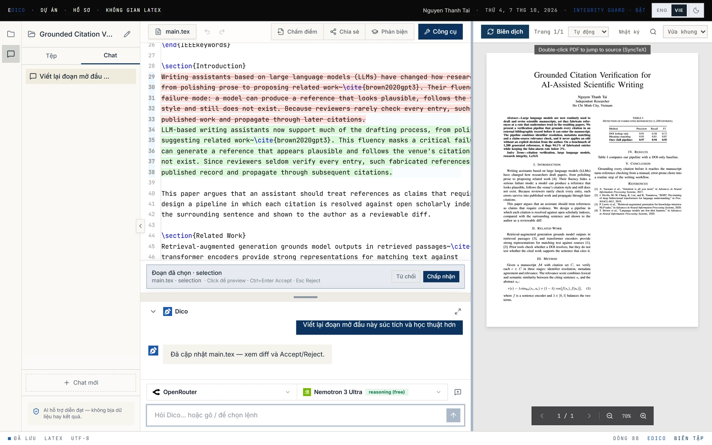
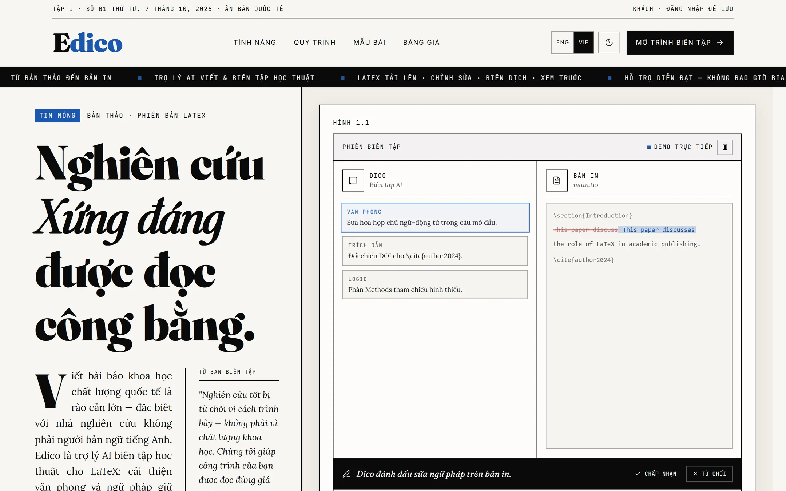
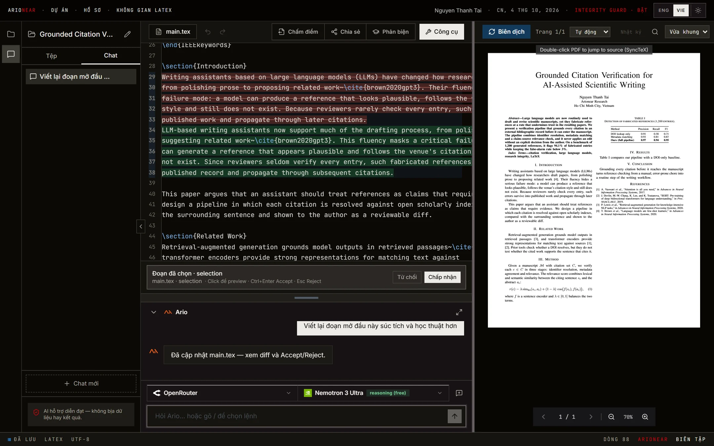
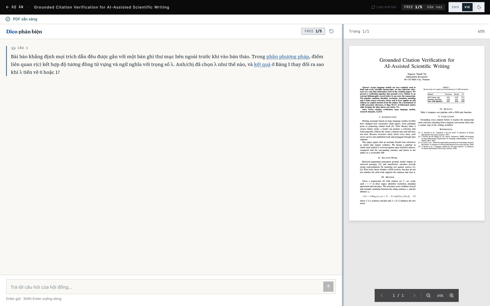
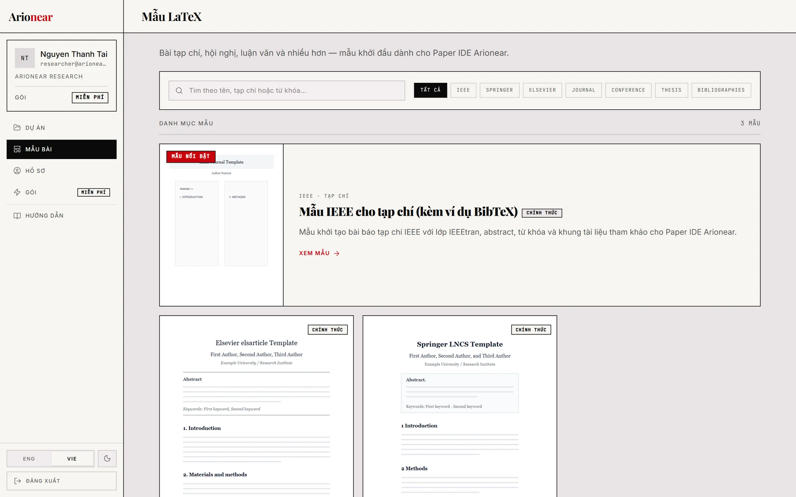
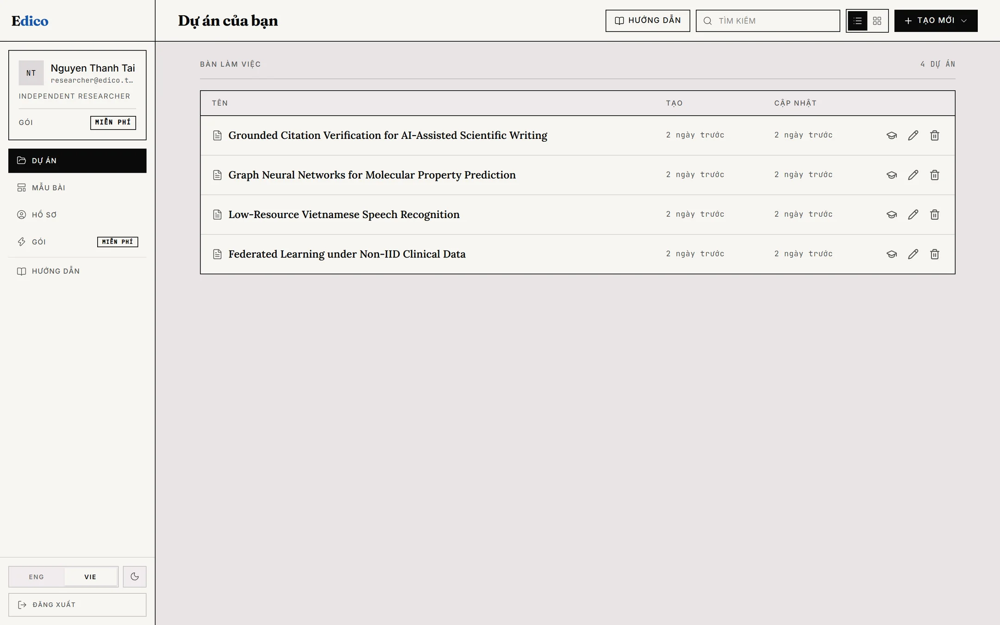
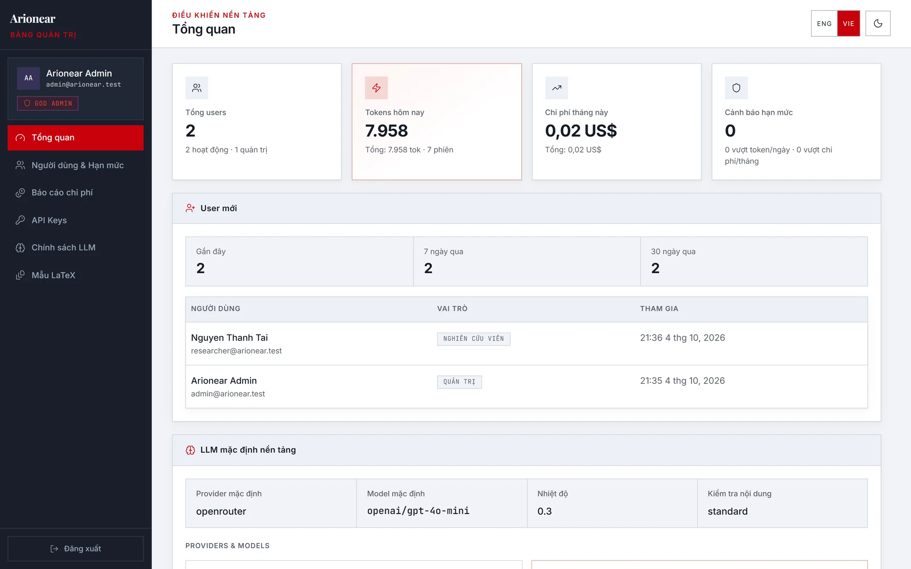

<div align="center">

# Arionear

### *Closer to Publication*

**Trợ lý AI biên tập bài báo khoa học trên LaTeX — gợi ý như một biên tập viên, quyết định vẫn thuộc về tác giả.**

[](https://github.com/Tai-TZ/arionear-ai-paper-editor/actions/workflows/ci.yml)
[](https://github.com/Tai-TZ/arionear-ai-paper-editor/actions/workflows/security.yml)
[](https://github.com/Tai-TZ/arionear-ai-paper-editor/actions/workflows/docker.yml)
[](https://github.com/Tai-TZ/arionear-ai-paper-editor/actions/workflows/latex.yml)


[Giao diện](#️-giao-diện) · [Tính năng](#-tính-năng) · [Kiến trúc](#️-kiến-trúc) · [Bắt đầu nhanh](#-bắt-đầu-nhanh) · [API](#-api) · [Cấu trúc](#-cấu-trúc-thư-mục)

</div>

---

## 📖 Giới thiệu

Viết một bài báo khoa học tốt không chỉ là chuyện ngữ pháp: văn phong học thuật, cấu trúc IMRaD, trích dẫn chính xác và mạch lập luận nhất quán đều quyết định bản thảo có được chấp nhận hay không. Các công cụ AI phổ thông thường **viết lại** thay cho tác giả — và đôi khi **bịa** số liệu hoặc trích dẫn.

**Arionear** đi theo hướng ngược lại: một nền tảng **Assisted Editing** nơi trợ lý AI **Ario** đóng vai biên tập viên. Ario đọc bản thảo LaTeX, đề xuất chỉnh sửa có ngữ cảnh, và **mọi thay đổi đều hiển thị dưới dạng diff** để tác giả **Accept / Reject** — AI không bao giờ tự sửa hay tự publish thay con người.

```text
Mở project → Soạn LaTeX → Chat với Ario → Xem diff → Accept / Reject → Compile PDF
```

### Nguyên tắc thiết kế

| | Nguyên tắc | Ý nghĩa |
|---|---|---|
| 🧑‍⚖️ | **Human Gate** | Mọi output của AI đi qua diff + Accept/Reject — tác giả luôn là người quyết định cuối cùng |
| 🛡️ | **Integrity Guard** | Không thay đổi ý nghĩa khoa học, không bịa dữ liệu, kết quả hay trích dẫn |
| 🧱 | **Guardrail 4 lớp** | Prompt constraints → kiểm tra numeric drift / độ dài → Human Gate → audit log |
| 🔌 | **Model-agnostic** | Chọn provider/model ngay trong editor; admin cấu hình platform keys với failover theo độ ưu tiên |

---

## 🖼️ Giao diện

<p align="center">
  
</p>
<p align="center"><sub><b>Editor</b> — bôi đen đoạn mở đầu và nhờ Ario viết lại: đề xuất hiện thành diff đỏ/xanh chờ tác giả <b>Từ chối / Chấp nhận</b>; PDF biên dịch ngay bên cạnh, nhấp đúp để nhảy về dòng LaTeX (SyncTeX).</sub></p>

<table>
<tr>
<td width="50%" valign="top">
  
  <br><sub><b>Trang chủ</b> — phong cách báo in, demo phiên biên tập trực tiếp</sub>
</td>
<td width="50%" valign="top">
  
  <br><sub><b>Dark mode</b> — cùng phiên biên tập ở giao diện tối</sub>
</td>
</tr>
<tr>
<td width="50%" valign="top">
  
  <br><sub><b>Defense Mode</b> — hội đồng AI hỏi bám sát bài, link nhảy thẳng tới đoạn liên quan trong PDF</sub>
</td>
<td width="50%" valign="top">
  
  <br><sub><b>Template gallery</b> — IEEE, Springer LNCS, Elsevier</sub>
</td>
</tr>
<tr>
<td width="50%" valign="top">
  
  <br><sub><b>Dự án</b> — bàn làm việc của nhà nghiên cứu</sub>
</td>
<td width="50%" valign="top">
  
  <br><sub><b>Admin console</b> — người dùng, token, chi phí và chính sách LLM</sub>
</td>
</tr>
</table>

<sub>Ảnh chụp từ bản chạy local với dữ liệu demo; phản hồi AI trong ảnh lấy từ một LLM giả lập (OpenAI-compatible) để có thể tái lập.</sub>

---

## ✨ Tính năng

<table>
<tr>
<td width="50%" valign="top">

### ✍️ Biên tập với Ario
- **Style** — nâng văn phong học thuật, giữ nguyên nội dung
- **Structure** — phân tích IMRaD, chỉ ra phần thiếu/thừa
- **Template** — sinh khung section còn thiếu
- **Citation** — xác minh trích dẫn qua arXiv · CrossRef · Semantic Scholar · OpenAlex
- **Citation relevance (L4)** — LLM kiểm tra nguồn có thực sự ủng hộ câu khẳng định
- **Quick Edit** (`Ctrl+K`) — bôi đen một đoạn và ra lệnh trực tiếp
- **Slash commands** và chat streaming (SSE)

</td>
<td width="50%" valign="top">

### 🔬 Đánh giá chất lượng bài
- **Logic Audit** (Quick / Deep) — kiểm tra mạch lập luận xuyên suốt các phần
- **Publication Score Gate** — chấm điểm bản thảo trước khi export
- **Defense Mode** — hội đồng AI phản biện thử (mock viva)
- **Academic Integrity Monitor** — chặn chỉnh sửa làm lệch số liệu
- **Peer-review response** — tách góp ý reviewer, soạn thư phản hồi từng điểm (`[AUTHOR: …]` thay cho số liệu AI không biết)
- **AI disclosure** — báo cáo đóng góp của AI + đoạn tuyên bố cho tạp chí (EN/VI, LaTeX)

</td>
</tr>
<tr>
<td width="50%" valign="top">

### 📄 Môi trường LaTeX đầy đủ
- Editor đa file với outline, upload hình ảnh và tài nguyên
- Compile PDF phía server (TeX Live) + **SyncTeX** nhảy qua lại code ↔ PDF
- Import **Overleaf ZIP**, **Word (.docx)** và **PDF** (text) thành LaTeX
- **Template gallery**: IEEE, Springer LNCS, Elsevier (elsarticle)
- Chia sẻ bản thảo bằng **link read-only**; đồng bộ live (Yjs + WebSocket) chỉ mở cho chủ sở hữu

</td>
<td width="50%" valign="top">

### ⚙️ Nền tảng
- Xác thực **JWT** (email/password, xác minh email) + **Google SSO**
- **Admin console** — người dùng, chính sách LLM, quota, báo cáo chi phí
- **Billing** theo tier (FREE / PRO) với giới hạn lượt Defense
- Giao diện **song ngữ EN / VI**, dark mode, responsive cho mobile

</td>
</tr>
</table>

---

## 🏗️ Kiến trúc

<p align="center">
  
</p>

Luồng chính của editor chạy qua **SSE streaming**: Intent Router phân loại yêu cầu (rules → LLM fallback), chuyển đến agent tương ứng; output đi qua Integrity Monitor trước khi trở thành diff cho người dùng duyệt.

<p align="center">
  
</p>

Chi tiết từng thành phần, guardrail và data flow: xem [ARCHITECTURE.md](./ARCHITECTURE.md) và [docs/architecture_diagram.md](./docs/architecture_diagram.md).

### Tech stack

| Layer | Công nghệ |
|---|---|
| **Frontend** | TanStack Start · React 19 · shadcn/ui · Tailwind CSS v4 · Vite · PDF.js |
| **Backend** | FastAPI · Python 3.11+ · LangGraph · SQLAlchemy · SSE / WebSocket |
| **LLM** | Google Gemini · OpenRouter · OpenAI · Anthropic · Z.AI (GLM) |
| **Dữ liệu** | PostgreSQL · Prisma (schema & migrations) |
| **LaTeX** | pdflatex (TeX Live) · SyncTeX · delta asset compile + PDF cache |
| **Hạ tầng** | Docker · Google Cloud Run · GitHub Actions CI/CD (không deploy) |
| **Observability** | LangSmith tracing · Inngest *(tùy chọn)* |

### CI/CD

<p align="center">
  
</p>

Mọi push/PR chạy CI (Ruff, pytest 3.11 + 3.12, frontend, Prisma trên Postgres 16), Security (CodeQL, pip-audit, npm audit, gitleaks), Docker (build + smoke test, không push) và LaTeX; tag `vX.Y.Z` tạo GitHub Release. Chi tiết: [ARCHITECTURE.md §8.1](./ARCHITECTURE.md#81-cicd-pipeline).

---

## 🚀 Bắt đầu nhanh

### Yêu cầu

- **Python 3.11+**, **Node.js 20+**
- **PostgreSQL** (local hoặc Prisma Postgres)
- Ít nhất **một LLM API key**: `GOOGLE_API_KEY`, `OPENROUTER_API_KEY`, `OPENAI_API_KEY`, `ANTHROPIC_API_KEY` hoặc `ZAI_API_KEY`
- *(Tùy chọn)* **TeX distribution** để compile PDF — MiKTeX (Windows) / TeX Live (macOS, Linux)

### 1. Clone & cấu hình

```bash
git clone https://github.com/Tai-TZ/arionear-ai-paper-editor.git
cd arionear-ai-paper-editor
cp .env.example .env   # điền API key, DIRECT_DATABASE_URL, AUTH_SECRET_KEY
```

### 2. Backend

```bash
python -m venv .venv
source .venv/bin/activate        # Windows: .\.venv\Scripts\Activate.ps1
pip install -r requirements-dev.txt   # runtime + pytest, ruff
```

### 3. Database

```bash
npm install
npm run db:generate
npm run db:migrate
```

> Xem [docs/DATABASE_SETUP.md](./docs/DATABASE_SETUP.md) để cấu hình PostgreSQL local hoặc Prisma Postgres.

### 4. Frontend

```bash
cd frontend && npm install && cd ..
```

### 5. Chạy development

```bash
# Terminal 1 — Backend (http://127.0.0.1:8000)
python -m uvicorn src.main:app --host 127.0.0.1 --port 8000 --reload

# Terminal 2 — Frontend (proxy /api/v1 → backend)
cd frontend && npm run dev
```

Mở URL mà Vite in ra (mặc định `http://localhost:8080`). Nếu backend chạy port khác, đặt `VITE_DEV_API_PROXY=http://127.0.0.1:<port>` trước khi chạy frontend.

### 6. Kiểm tra

```bash
curl http://127.0.0.1:8000/health               # → "status": "ok"
curl http://127.0.0.1:8000/api/v1/compile/status # → "available": true nếu đã cài TeX
```

<details>
<summary><b>🐳 Chạy bằng Docker</b></summary>

<br>

Image backend đã bao gồm TeX Live và chạy ở port `8000`.

```bash
docker compose build
docker compose up -d
curl http://localhost:8000/api/v1/compile/status
```

Cài TeX thủ công cho môi trường local:

| OS | Lệnh |
|---|---|
| Windows | `winget install MiKTeX.MiKTeX` |
| macOS | `brew install --cask miktex` |
| Linux | `sudo apt install texlive-latex-base texlive-latex-extra texlive-fonts-recommended` |

Chi tiết vận hành PDF preview: [docs/pdf-preview-deploy.md](./docs/pdf-preview-deploy.md).

</details>

---

## 🔧 Cấu hình môi trường

Toàn bộ biến kèm chú thích nằm trong [`.env.example`](./.env.example). **Không commit file `.env`.**

| Biến | Bắt buộc | Mô tả |
|---|:---:|---|
| `LLM_PROVIDER` | ✅ | Provider mặc định: `google` · `openrouter` · `openai` · `anthropic` · `zai` |
| `GOOGLE_API_KEY` / `OPENROUTER_API_KEY` / … | ✅ | Ít nhất một key khớp với `LLM_PROVIDER` |
| `DIRECT_DATABASE_URL` | ✅ | PostgreSQL TCP cho FastAPI / SQLAlchemy |
| `DATABASE_URL` | ✅ | URL cho Prisma CLI (có thể là `prisma+postgres://`) |
| `AUTH_SECRET_KEY` | ✅ | JWT secret — tạo bằng `openssl rand -hex 32`; production từ chối khởi động nếu để mặc định hoặc ngắn hơn 32 ký tự |
| `APP_ENV` · `LOG_LEVEL` | | `production` bật kiểm tra cấu hình, HSTS và log JSON (Cloud Logging); `development` log dạng text |
| `FRONTEND_BASE_URL` · `BACKEND_BASE_URL` · `CORS_ORIGINS` | | URL công khai và origins được phép |
| `GOOGLE_CLIENT_ID` · `GOOGLE_CLIENT_SECRET` | | Đăng nhập Google SSO |
| `SMTP_*` | | Gửi email xác minh (dev: mã in ra log) |
| `BILLING_DEMO_CHECKOUT` | | Bật checkout QR demo (không thu tiền) — mặc định **tắt** ở production |
| `PLATFORM_REQUEST_TIMEOUT_SEC` · `GCP_PROJECT_ID` | | Giới hạn thời gian request của nền tảng (Cloud Run: 300s) · gắn log với Cloud Trace |
| `LANGCHAIN_API_KEY` · `LANGCHAIN_TRACING_V2` | | LangSmith tracing |
| `VITE_API_URL` | | API URL khi build frontend production (bỏ trống → cùng origin `/api/v1`) |

---

## 💬 Ví dụ sử dụng

Mở `/editor`, tạo project mẫu rồi gửi các yêu cầu sau trong khung chat Ario:

| Task | Prompt mẫu | Kết quả |
|---|---|---|
| `chat` | *Giải thích ngắn gọn abstract của bài này* | Trả lời theo ngữ cảnh, không tạo diff |
| `style` | *Chỉnh sửa abstract cho văn phong học thuật hơn* | Diff đỏ/xanh + Accept/Reject |
| `structure` | *Phân tích cấu trúc IMRaD của bài này* | Danh sách section thiếu/thừa |
| `template` | *Thêm các section IMRaD còn thiếu* | Khung section gợi ý |
| `citation` | *Kiểm tra trích dẫn trong bài* | Báo cáo xác minh từng cite key |

Gọi trực tiếp qua API (SSE stream — luồng chính của editor):

```bash
curl -N -X POST http://127.0.0.1:8000/api/v1/chat/stream \
  -H "Content-Type: application/json" \
  -H "Accept: text/event-stream" \
  -d '{
    "message": "Chỉnh sửa abstract cho văn phong học thuật hơn",
    "task": "style",
    "latex_content": "\\documentclass{article}\\begin{document}\\begin{abstract}Machine learning models achieve strong results but often lack interpretability.\\end{abstract}\\end{document}"
  }'
```

---

## 🔌 API

Tất cả endpoint nằm dưới prefix `/api/v1`. Tài liệu tương tác (Swagger UI) có sẵn tại `http://127.0.0.1:8000/docs` khi chạy backend.

| Nhóm | Endpoint | Mô tả |
|---|---|---|
| **Ario** | `POST /chat/stream` · `POST /chat` | Chat với agent (SSE / sync qua LangGraph) |
| | `POST /edit/style` | Chỉnh văn phong một đoạn |
| | `POST /citations/verify` · `POST /citations/relevance` | Xác minh trích dẫn · chấm độ liên quan (L4) |
| | `POST /review/respond` | Soạn phản hồi peer review |
| | `POST /defense/stream` | Defense Mode — mock viva |
| **LaTeX** | `POST /compile` · `POST /compile/synctex` | Compile PDF · tra vị trí SyncTeX |
| **Dữ liệu** | `/papers` · `/sessions` · `/templates` | CRUD bản thảo, phiên làm việc, template |
| | `POST /import/document` | Import DOCX / PDF → LaTeX |
| | `GET /papers/{id}/ai-disclosure` | Báo cáo đóng góp của AI |
| | `POST /revisions/{session}/{id}` | Ghi nhận Accept / Reject |
| **Chia sẻ** | `/papers/{id}/share` · `GET /share/{token}` · `WS /ws/share/{token}` | Link read-only; WebSocket đồng bộ live chỉ cho chủ sở hữu (subprotocol `bearer.<token>`) |
| **Tài khoản** | `/auth/*` · `/users/me/profile` · `/billing/*` | Đăng nhập, SSO, hồ sơ, gói dịch vụ |
| **Quản trị** | `/admin/*` | Người dùng, LLM keys & policy, báo cáo chi phí |
| **Hệ thống** | `GET /health` · `GET /ready` · `GET /status` · `GET /providers` | Liveness, readiness (DB + TeX), trạng thái agent, provider khả dụng |

---

## 📁 Cấu trúc thư mục

```text
arionear-ai-paper-editor/
├── src/                  # Backend FastAPI
│   ├── agents/           #   LangGraph graph & các agent của Ario
│   ├── api/              #   REST / SSE / WebSocket routes
│   ├── services/         #   Logic audit, defense, compile, citation, guardrails…
│   ├── prompts/          #   Prompt templates (YAML)
│   ├── db/  models/      #   SQLAlchemy models & Pydantic schemas
│   └── main.py           #   Entry point
├── frontend/             # TanStack Start + React 19
│   └── src/{routes,features,components,lib}
├── prisma/               # Database schema & migrations
├── tests/                # Pytest suite
├── eval/                 # Bộ dữ liệu, script và kết quả đánh giá
├── scripts/              # Setup & deploy (Cloud Run)
├── docs/                 # Tài liệu kỹ thuật
├── Dockerfile · docker-compose.yml
└── ARCHITECTURE.md · ROADMAP.md · EVALUATION.md
```

---

## 👤 Tác giả

**Nguyễn Thành Tài** — [@Tai-TZ](https://github.com/Tai-TZ)

## 📄 License

Phát hành theo giấy phép [MIT](./LICENSE).
