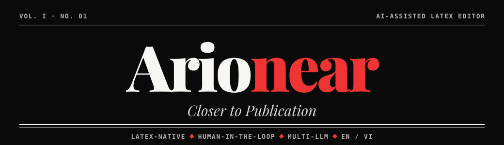

<div align="center">



**Trợ lý AI biên tập bài báo khoa học trên LaTeX — gợi ý như một biên tập viên, quyết định vẫn thuộc về tác giả.**

[](https://github.com/Tai-TZ/edico-ai-paper-editor/actions/workflows/ci.yml)
[](https://github.com/Tai-TZ/edico-ai-paper-editor/actions/workflows/security.yml)
[](https://github.com/Tai-TZ/edico-ai-paper-editor/actions/workflows/docker.yml)
[](https://github.com/Tai-TZ/edico-ai-paper-editor/actions/workflows/latex.yml)


[Giới thiệu](#-giới-thiệu) · [Tính năng](#-tính-năng) · [Kiến trúc](#️-kiến-trúc) · [Bắt đầu nhanh](#-bắt-đầu-nhanh) · [Cấu trúc](#-cấu-trúc-thư-mục) · [Giao diện](#️-giao-diện)

</div>

---

## 📖 Giới thiệu

**Edico** là trình biên tập LaTeX cho bài báo khoa học, đi kèm trợ lý AI **Dico** làm việc như một biên tập viên: đọc toàn bộ bản thảo, góp ý văn phong học thuật, cấu trúc IMRaD, trích dẫn và mạch lập luận. Mỗi đề xuất hiện thành **diff** để tác giả **Chấp nhận / Từ chối** — Dico không tự sửa bản thảo và không bịa số liệu hay trích dẫn.

Mọi việc diễn ra ngay trong trình duyệt: soạn LaTeX, biên dịch PDF với SyncTeX, xác minh trích dẫn qua arXiv · Crossref · Semantic Scholar · OpenAlex, chấm điểm bản thảo trước khi nộp và luyện bảo vệ với hội đồng phản biện AI. Dự án hướng tới nhà nghiên cứu cần đưa bài lên chuẩn xuất bản quốc tế, đặc biệt là người viết tiếng Anh như một ngoại ngữ.

```text
Mở project → Soạn LaTeX → Hỏi Dico → Xem diff → Chấp nhận / Từ chối → Biên dịch PDF
```

### Nguyên tắc thiết kế

| | Nguyên tắc | Ý nghĩa |
|---|---|---|
| 🧑‍⚖️ | **Human Gate** | Mọi output của AI đi qua diff + Accept/Reject — tác giả luôn là người quyết định cuối cùng |
| 🛡️ | **Integrity Guard** | Không thay đổi ý nghĩa khoa học, không bịa dữ liệu, kết quả hay trích dẫn |
| 🧱 | **Guardrail 4 lớp** | Prompt constraints → kiểm tra numeric drift / độ dài → Human Gate → audit log |
| 🔌 | **Model-agnostic** | Chọn provider/model ngay trong editor; admin cấu hình platform keys với failover theo độ ưu tiên |

---

## ✨ Tính năng

<p align="center">
  
</p>

---

## 🏗️ Kiến trúc

<p align="center">
  
</p>

Luồng chính của editor chạy qua **SSE streaming**: Intent Router phân loại yêu cầu (rules → LLM fallback), chuyển đến agent tương ứng; output đi qua Integrity Monitor trước khi trở thành diff cho người dùng duyệt.

<p align="center">
  
</p>

Chi tiết từng thành phần, guardrail và data flow: xem [ARCHITECTURE.md](./ARCHITECTURE.md) và [docs/architecture_diagram.md](./docs/architecture_diagram.md).

### Tech stack

<p align="center">
  
</p>

### CI/CD

<p align="center">
  
</p>

Mọi push/PR chạy CI (Ruff, pytest 3.11 + 3.12, frontend, Prisma trên Postgres 16), Security (CodeQL, pip-audit, npm audit, gitleaks), Docker (build + smoke test, không push) và LaTeX; tag `vX.Y.Z` tạo GitHub Release. Chi tiết: [ARCHITECTURE.md §8.1](./ARCHITECTURE.md#81-cicd-pipeline).

---

## 🚀 Bắt đầu nhanh

### Yêu cầu

- **Python 3.11+**, **Node.js 20+**
- **PostgreSQL** (local hoặc Prisma Postgres)
- Ít nhất **một LLM API key**: `GOOGLE_API_KEY`, `OPENROUTER_API_KEY`, `OPENAI_API_KEY`, `ANTHROPIC_API_KEY` hoặc `ZAI_API_KEY`
- *(Tùy chọn)* **TeX distribution** để compile PDF — MiKTeX (Windows) / TeX Live (macOS, Linux)

### 1. Clone & cấu hình

```bash
git clone https://github.com/Tai-TZ/edico-ai-paper-editor.git
cd edico-ai-paper-editor
cp .env.example .env   # điền API key, DIRECT_DATABASE_URL, AUTH_SECRET_KEY
```

### 2. Backend

```bash
python -m venv .venv
source .venv/bin/activate        # Windows: .\.venv\Scripts\Activate.ps1
pip install -r requirements-dev.txt   # runtime + pytest, ruff
```

### 3. Database

```bash
npm install
npm run db:generate
npm run db:migrate
```

> Xem [docs/DATABASE_SETUP.md](./docs/DATABASE_SETUP.md) để cấu hình PostgreSQL local hoặc Prisma Postgres.

### 4. Frontend

```bash
cd frontend && npm install && cd ..
```

### 5. Chạy development

```bash
# Terminal 1 — Backend (http://127.0.0.1:8000)
python -m uvicorn src.main:app --host 127.0.0.1 --port 8000 --reload

# Terminal 2 — Frontend (proxy /api/v1 → backend)
cd frontend && npm run dev
```

Mở URL mà Vite in ra (mặc định `http://localhost:8080`). Nếu backend chạy port khác, đặt `VITE_DEV_API_PROXY=http://127.0.0.1:<port>` trước khi chạy frontend.

### 6. Kiểm tra

```bash
curl http://127.0.0.1:8000/health               # → "status": "ok"
curl http://127.0.0.1:8000/api/v1/compile/status # → "available": true nếu đã cài TeX
```

<details>
<summary><b>🐳 Chạy bằng Docker</b></summary>

<br>

Image backend đã bao gồm TeX Live và chạy ở port `8000`.

```bash
docker compose build
docker compose up -d
curl http://localhost:8000/api/v1/compile/status
```

Cài TeX thủ công cho môi trường local:

| OS | Lệnh |
|---|---|
| Windows | `winget install MiKTeX.MiKTeX` |
| macOS | `brew install --cask miktex` |
| Linux | `sudo apt install texlive-latex-base texlive-latex-extra texlive-fonts-recommended` |

Chi tiết vận hành PDF preview: [docs/pdf-preview-deploy.md](./docs/pdf-preview-deploy.md).

</details>

<details>
<summary><b>☁️ Deploy lên Cloud Run</b></summary>

<br>

Deploy chạy tay bằng PowerShell (CI không deploy). Script đọc `.env` ở thư mục gốc và **không có domain mặc định**:

```powershell
scripts\deploy-cloudrun-backend.ps1 -FrontendUrl https://your-domain -BackendCustomDomain https://api.your-domain
scripts\deploy-cloudrun-frontend.ps1 -ViteApiUrl https://api.your-domain/api/v1
```

Service mặc định là `edico-api` / `edico-web` (đổi bằng `-ServiceName`); thêm `-SkipBuild` khi chỉ cập nhật biến môi trường. Chi tiết: [ARCHITECTURE.md §8](./ARCHITECTURE.md).

</details>

---

## 🔧 Cấu hình môi trường

Toàn bộ biến kèm chú thích nằm trong [`.env.example`](./.env.example). **Không commit file `.env`.**

| Biến | Bắt buộc | Mô tả |
|---|:---:|---|
| `LLM_PROVIDER` | ✅ | Provider mặc định: `google` · `openrouter` · `openai` · `anthropic` · `zai` |
| `GOOGLE_API_KEY` / `OPENROUTER_API_KEY` / … | ✅ | Ít nhất một key khớp với `LLM_PROVIDER` |
| `DIRECT_DATABASE_URL` | ✅ | PostgreSQL TCP cho FastAPI / SQLAlchemy |
| `DATABASE_URL` | ✅ | URL cho Prisma CLI (có thể là `prisma+postgres://`) |
| `AUTH_SECRET_KEY` | ✅ | JWT secret — tạo bằng `openssl rand -hex 32`; production từ chối khởi động nếu để mặc định hoặc ngắn hơn 32 ký tự |
| `APP_ENV` · `LOG_LEVEL` | | `production` bật kiểm tra cấu hình, HSTS và log JSON (Cloud Logging); `development` log dạng text |
| `FRONTEND_BASE_URL` · `BACKEND_BASE_URL` · `CORS_ORIGINS` | | URL công khai và origins được phép |
| `CORS_ORIGIN_REGEX` | | Chỉ production: thêm origins theo regex, vd. `https://([a-z0-9-]+\.)*your-domain\.com` |
| `GOOGLE_CLIENT_ID` · `GOOGLE_CLIENT_SECRET` | | Đăng nhập Google SSO |
| `SMTP_*` | | Gửi email xác minh (dev: mã in ra log) |
| `BILLING_DEMO_CHECKOUT` | | Bật checkout QR demo (không thu tiền) — mặc định **tắt** ở production |
| `PLATFORM_REQUEST_TIMEOUT_SEC` · `GCP_PROJECT_ID` | | Giới hạn thời gian request của nền tảng (Cloud Run: 300s) · gắn log với Cloud Trace |
| `LANGCHAIN_API_KEY` · `LANGCHAIN_TRACING_V2` | | LangSmith tracing |
| `VITE_API_URL` | | API URL khi build frontend production (bỏ trống → cùng origin `/api/v1`) |

---

## 📁 Cấu trúc thư mục

```text
edico-ai-paper-editor/
├── src/                  # Backend FastAPI
│   ├── agents/           #   LangGraph graph & các agent của Dico
│   ├── api/              #   REST / SSE / WebSocket routes
│   ├── services/         #   Logic audit, defense, compile, citation, guardrails…
│   ├── prompts/          #   Prompt templates (YAML)
│   ├── db/  models/      #   SQLAlchemy models & Pydantic schemas
│   └── main.py           #   Entry point
├── frontend/             # TanStack Start + React 19
│   └── src/{routes,features,components,lib}
├── prisma/               # Database schema & migrations
├── tests/                # Pytest suite
├── eval/                 # Bộ dữ liệu, script và kết quả đánh giá
├── scripts/              # Setup & deploy (Cloud Run)
├── docs/                 # Tài liệu kỹ thuật
├── Dockerfile · docker-compose.yml
└── ARCHITECTURE.md · ROADMAP.md · EVALUATION.md
```

---

## 🖼️ Giao diện

<p align="center">
  
</p>
<p align="center"><sub><b>Editor</b> — bôi đen đoạn mở đầu và nhờ Dico viết lại: đề xuất hiện thành diff đỏ/xanh chờ tác giả <b>Từ chối / Chấp nhận</b>; PDF biên dịch ngay bên cạnh, nhấp đúp để nhảy về dòng LaTeX (SyncTeX).</sub></p>

<table>
<tr>
<td width="50%" valign="top">
  
  <br><sub><b>Trang chủ</b> — phong cách báo in, demo phiên biên tập trực tiếp</sub>
</td>
<td width="50%" valign="top">
  
  <br><sub><b>Dark mode</b> — cùng phiên biên tập ở giao diện tối</sub>
</td>
</tr>
<tr>
<td width="50%" valign="top">
  
  <br><sub><b>Defense Mode</b> — hội đồng AI hỏi bám sát bài, link nhảy thẳng tới đoạn liên quan trong PDF</sub>
</td>
<td width="50%" valign="top">
  
  <br><sub><b>Template gallery</b> — IEEE, Springer LNCS, Elsevier</sub>
</td>
</tr>
<tr>
<td width="50%" valign="top">
  
  <br><sub><b>Dự án</b> — bàn làm việc của nhà nghiên cứu</sub>
</td>
<td width="50%" valign="top">
  
  <br><sub><b>Admin console</b> — người dùng, token, chi phí và chính sách LLM</sub>
</td>
</tr>
</table>

<sub>Nhận diện: phong cách báo in trên nền giấy, tiêu đề chữ Fraunces, màu nhấn xanh bút chì; màu đỏ chỉ dành cho lỗi và phần bị xóa trong diff.</sub><br>
<sub>Ảnh chụp từ bản chạy local với dữ liệu demo; phản hồi AI trong ảnh lấy từ một LLM giả lập (OpenAI-compatible) để có thể tái lập.</sub>

---

## 👤 Tác giả

**Nguyễn Thành Tài** — [@Tai-TZ](https://github.com/Tai-TZ)

## 📄 License

Phát hành theo giấy phép [MIT](./LICENSE).

Thư viện, font, file LaTeX và nguồn dữ liệu bên thứ ba cùng giấy phép của chúng được liệt kê trong [THIRD_PARTY_NOTICES.md](./THIRD_PARTY_NOTICES.md); toàn văn các giấy phép nằm trong [LICENSES/](./LICENSES).
