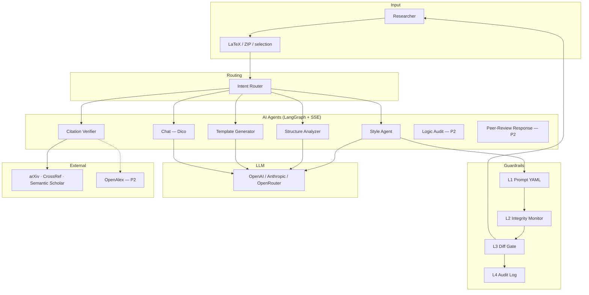
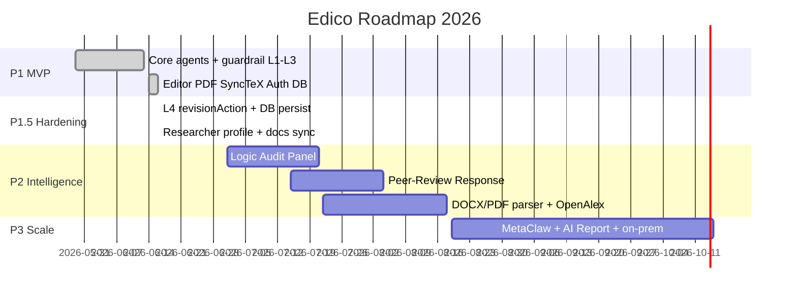

# ROADMAP — Edico

**Tagline:** *From draft to proof.*  
**Cập nhật:** 16/06/2026  
**Tham chiếu:** [ARCHITECTURE.md](./ARCHITECTURE.md)

---

## 1. Tầm nhìn sản phẩm

Edico là nền tảng **Assisted Editing** — AI đóng vai biên tập viên (**Dico**), giúp researcher cải thiện bản thảo học thuật **không thay đổi ý nghĩa khoa học** và **không bịa dữ liệu**. Mọi output AI đều qua **Human Gate** (diff + Accept/Reject).

### Nguyên tắc bất biến (mọi phase)

| # | Nguyên tắc |
|---|------------|
| 1 | **Human Supremacy** — Researcher quyết định cuối; AI không commit thay đổi |
| 2 | **Transparent AI** — Mọi can thiệp hiển thị, audit được, export được |
| 3 | **Containment** — LLM chỉ làm việc trên thông tin có trong bản thảo |
| 4 | **Graceful degradation** — Guardrail fail → trả “không suggestion an toàn”, không ép output rủi ro |
| 5 | **Researcher attribution** — Bài báo là của researcher; AI là công cụ |

### Cố ý loại bỏ (từ ARC)

- **Experiment Sandbox** — nguy cơ fabrication dữ liệu thực nghiệm  
- **PIVOT/REFINE loop** — AI không được đóng vai investigator  

---

## 2. Trạng thái hiện tại (baseline 16/06/2026)

### ✅ Đã hoàn thành

| Lớp | Thành phần | Ghi chú |
|-----|------------|---------|
| **Editor** | LaTeX multi-file, Overleaf ZIP import, compile log, PDF.js preview | Overleaf-style |
| **Editor** | SyncTeX inverse (double-click PDF → source), word/context disambiguation, highlight + auto-scroll | |
| **Backend** | LaTeX compile multi-engine (pdflatex/xelatex/lualatex), latexmk, biber, stubs | |
| **AI — Orchestrator** | LangGraph + SSE streaming (`chat_stream.py`) | |
| **AI — Agents** | Style, Structure, Citation, Template (IMRAD), Chat (Dico) | |
| **AI — Routing** | Intent router (regex + LLM classifier) | |
| **AI — Guardrail** | L1 prompt constraint, L2 integrity check + retry, L3 diff gate | |
| **AI — Citation** | 4-layer verify: arXiv → CrossRef → Semantic Scholar | Lớp 4 LLM chưa có |
| **Infra** | JWT auth, Prisma/Postgres papers API, dark/light theme | |
| **Infra** | Researcher profile (`/profile`, `GET/PATCH /users/me/profile`) | ✅ |
| **L4 Audit** | `revisionAction` on Accept/Reject, `GET /sessions/{id}/revisions` | ✅ |
| **Persistence** | `revision_history` + `citation_registry` qua DB session store | ✅ |
| **DevOps** | CI (pytest + ruff), Docker backend | |

### ⚠️ Còn thiếu / partial (P2+)

| Thành phần | Gap |
|------------|-----|
| Tài liệu | `ARCHITECTURE.md` §4.1 vẫn ghi mock auth / localStorage projects ở vài chỗ |
| Collaborative edit | Link chia sẻ Yjs mới ở chế độ chỉ đọc |
| Citation reformat / DataCite | Chưa có (P2) |
| PDF import | Chỉ lấy text — không dựng lại hình, bảng, công thức |

---

## 3. Bản đồ AI trong dự án

| Agent | Input | Output | LLM? | Trạng thái |
|-------|-------|--------|------|------------|
| **Dico (chat)** | Message + latex context + selection | Text / gợi ý chung | ✅ | ✅ |
| **Style** | Selection hoặc section | Polished text + diff | ✅ | ✅ |
| **Structure** | Parsed sections | JSON suggestions | ✅ (rules + LLM) | ✅ |
| **Citation** | Cite keys + BibTeX | Status report 4 lớp | ❌ (L1–3) / ✅ (L4) | ✅ L1–4 + OpenAlex |
| **Template** | Chat “sườn IMRAD” | Full document skeleton + diff | ✅ (template_latex) | ✅ |
| **Logic Audit** | Full draft | Conflict report (comment only) | ✅ multi-agent | ✅ |
| **Peer-Review** | Reviewer comments + draft | Response draft Major/Minor | ✅ | ✅ |

---

## 4. Lộ trình theo phase

### Phase 1 — Foundation MVP ✅ *(đóng)*

**Mục tiêu:** Core pipeline + guardrail cơ bản + human gate.

| # | Hạng mục | Trạng thái |
|---|----------|------------|
| 1.1 | LaTeX parser + editor | ✅ |
| 1.2 | Style Agent + L1–L2 guardrail | ✅ |
| 1.3 | Citation Verifier (L1–3 deterministic) | ✅ |
| 1.4 | Human Gate UI (diff Accept/Reject) | ✅ |
| 1.5 | Structure + Template + Chat streaming | ✅ |
| 1.6 | Prompts external YAML (C9) | ✅ |

**Kết quả:** Style fix + citation validation + diff gate — **đạt**.

---

### Phase 1.5 — Hardening & Trust ✅ *(đóng 16/06/2026)*

**Mục tiêu:** Đóng gap tin cậy (L4), persistence đầy đủ, editor production-ready.

#### 1.5.1 Guardrail L4 — Audit log đầy đủ ✅

| Task | Trạng thái |
|------|------------|
| Wire `revisionAction` on Accept/Reject | ✅ |
| Hiển thị revision history (Tools → Versions) | ✅ |
| Blocking flags disable Accept | ✅ |

#### 1.5.2 Persistence & session store ✅

| Task | Trạng thái |
|------|------------|
| Persist `revision_history` theo paper/session | ✅ |
| Persist `citation_registry` sau verify / chat citation | ✅ |
| `GET /sessions/{id}/revisions`, `GET /sessions/{id}/citations` | ✅ |

#### 1.5.3 Editor & compile ✅

| Task | Trạng thái |
|------|------------|
| Dev proxy port 8000 | ✅ |
| SyncTeX word/context disambiguation | ✅ |
| Horizontal scroll highlight | ✅ |

#### 1.5.4 Researcher profile ✅

| Task | Trạng thái |
|------|------------|
| Schema + API `GET/PATCH /users/me/profile` | ✅ |
| UI `/profile` + editor integration | ✅ |

**Kết quả P1.5:** ✅ Audit trail hoạt động + DB persist revision/citation + profile + docs (cập nhật tiếp).

---

### Phase 2 — Intelligence *(multi-agent mở rộng)*

**Mục tiêu:** Logic check, peer-review assist, import đa định dạng, citation nâng cao.

**Thời gian gợi ý:** 3–5 tuần  
**Phụ thuộc:** P1.5 L4 + persistence

#### 2.1 Logic Audit Panel (ARC C2 adapt) ✅

| Task | Mô tả |
|------|--------|
| `logic_node` trong LangGraph | Route intent `logic` |
| Multi-agent debate (2–3 personas) | Chỉ **comment** — không sửa draft |
| UI Logic Audit Panel | Danh sách conflict / weak claim / missing evidence |
| Guardrail | Không được thêm claim mới; output structured JSON |

**Done khi:** User gửi “kiểm tra logic” → nhận báo cáo conflict, không auto-apply.

#### 2.2 Peer-Review Response Agent ✅

`POST /api/v1/review/respond` + tab *Peer review* trong editor (`src/services/peer_review/`).

| Task | Mô tả |
|------|--------|
| `review_node` + intent `review` | Parse reviewer comments (paste hoặc upload) |
| Phân loại Major / Minor / Reject | Structured output |
| Draft phản hồi từng điểm | Human gate diff trước khi copy |
| `peer_review_log` trong session store | Persist theo paper |

#### 2.3 Unified Document Parser ✅ *(DOCX đầy đủ · PDF text-only)*

`POST /api/v1/import/document` (`src/services/document_import/`, python-docx + pdfplumber).

| Task | Mô tả |
|------|--------|
| `LaTeXAdapter` | ✅ hiện có |
| `DOCXAdapter` | mammoth/python-docx → `PaperStructure` |
| `PDFAdapter` | pdfplumber/pymupdf → text + heuristic sections |
| Upload UI | `/projects` + editor import DOCX/PDF |
| Normalize → LaTeX hoặc internal AST | Đưa vào cùng pipeline AI |

#### 2.4 Citation nâng cao ⚠️ *(OpenAlex + L4 ✅ · reformat & DataCite còn lại)*

`POST /api/v1/citations/relevance` + OpenAlex fallback (`src/services/citations/`).

| Task | Mô tả |
|------|--------|
| OpenAlex integration | Literature suggest + validate bổ sung |
| **Lớp 4** LLM relevance scoring | “Citation có support claim không?” |
| Citation.js / format reformat | IEEE, APA, Vancouver — deterministic rules |
| DataCite | DOI metadata fallback |

#### 2.5 Structure & Template nâng cao ⚠️ *(journal templates ✅)*

Springer LNCS, Elsevier (elsarticle) seed trong `src/services/template_builtins.py`. ACM (acmart) chưa đưa vào: class cần font Libertine/newtx trong `texlive-fonts-extra` (~1 GB) mà image production không cài.

| Task | Mô tả |
|------|--------|
| Journal-specific templates | IEEE, Elsevier, Springer skeletons |
| Structure auto-apply (optional) | Diff cho từng suggestion — user bật/tắt |
| LLM intent classifier ổn định hơn | Giảm fallback regex |

**Kết quả P2:** Full assisted-editing feature set theo ARC adapt — logic + review + multi-format import + citation L4.

---

### Phase 3 — Scale, Learning & Production

**Mục tiêu:** Production-ready, institution deploy, học từ usage (anonymized).

**Thời gian gợi ý:** 4–8 tuần  
**Phụ thuộc:** P2 stable + đủ session data

| # | Hạng mục | Mô tả |
|---|----------|--------|
| 3.1 | **MetaClaw** (ARC C8) | Học pattern “loại edit hay bị reject” — chỉ metadata ẩn danh |
| 3.2 | **AI Contribution Report** ✅ | `GET /papers/{id}/ai-disclosure` — JSON + tuyên bố EN/VI + LaTeX trong hộp thoại Export |
| 3.3 | **LangSmith production** | Trace end-to-end, eval datasets, regression |
| 3.4 | **Cost guardrail** | Token budget per session, model routing theo task |
| 3.5 | **Performance** | Cache citation verify, async compile queue, CDN PDF |
| 3.6 | **On-premise package** | Docker compose full stack + air-gapped LLM option |
| 3.7 | **Semantic integrity scoring** | Embedding/model score thay vì chỉ rule-based L2 |
| 3.8 | **Domain calibration** | Ngưỡng embedding theo lĩnh vực (y sinh, CS, …) |

**Kết quả P3:** Deploy được cho institution; báo cáo AI contribution; quality học dần từ usage.

---

## 5. Ma trận ưu tiên (Q3 2026)

| Ưu tiên | ID | Task | Phase | Effort |
|---------|-----|------|-------|--------|
| **P0** | R1 | Wire `revisionAction` on Accept/Reject | 1.5 | S |
| **P0** | R2 | Persist revision_history DB | 1.5 | M |
| **P1** | R3 | Persist citation_registry | 1.5 | M |
| **P1** | R4 | Researcher profile schema + API | 1.5 | M |
| **P1** | R5 | Cập nhật ARCHITECTURE + diagram | 1.5 | S |
| ✅ | R6 | Logic Audit Panel | 2 | L |
| ✅ | R7 | Peer-Review Response Agent | 2 | L |
| ✅ | R8 | DOCX import adapter (+ PDF text) | 2 | M |
| ✅ | R9 | OpenAlex + Citation L4 | 2 | M |
| ✅ | R10 | AI Contribution Report export | 3 | M |
| **P3** | R11 | MetaClaw opt-in | 3 | L |

*Effort: S = vài ngày, M = 1–2 tuần, L = 2+ tuần*

---

## 6. Milestone & timeline gợi ý

---

## 7. Tiêu chí “xong” từng phase

| Phase | Tiêu chí đạt |
|-------|----------------|
| **P1** | User compile LaTeX, chat Dico, nhận style/citation/structure suggestion qua diff, Accept/Reject — **đạt** |
| **P1.5** | ✅ Accept/Reject ghi audit DB; reload project thấy revision + citation registry |
| **P2** | Logic audit + peer-review draft; import DOCX; citation L4 + OpenAlex |
| **P3** | Export AI contribution report; LangSmith eval pass; on-prem docker one-command |

---

## 8. Rủi ro & phụ thuộc

| Rủi ro | Giảm thiểu |
|--------|------------|
| LLM hallucination trên citation L4 | L1–3 deterministic trước; L4 chỉ advisory |
| Chi phí token P2 multi-agent | Cost guardrail P3; model nhỏ cho routing |
| DOCX/PDF parse chất lượng kém | Human review step; giữ LaTeX là source of truth |
| Disk / MiKTeX trên Windows dev | Document compile requirements; CI Linux |
| Profile/PII | Opt-in; encrypt at rest; retention policy |

---

## 9. Việc tiếp theo (Phase 2)

Đã xong trong đợt này: Peer-Review Response Agent, DOCX/PDF import, OpenAlex + Citation L4, journal templates (Springer/Elsevier), AI Contribution Report.

1. **Collaborative edit** — mở link chia sẻ Yjs sang chế độ cùng sửa (phân quyền, presence, đồng bộ với coalesced saves)  
2. **Citation reformat** — IEEE / APA / Vancouver theo luật cố định + DataCite fallback  
3. **PDF import** — dựng lại bảng/hình (hiện chỉ text)  
4. **Structure auto-apply** — diff cho từng gợi ý, bật/tắt theo người dùng  
5. **Template ACM** — cần font Libertine/newtx (`texlive-fonts-extra` hoặc gói font tối thiểu) trong image  

---

## 10. Tài liệu liên quan

| File | Nội dung |
|------|----------|
| [ARCHITECTURE.md](./ARCHITECTURE.md) | Kiến trúc 4 tầng, guardrail, API |
| [docs/DATABASE_SETUP.md](./docs/DATABASE_SETUP.md) | Prisma + Postgres setup |

---

*Roadmap sống — cập nhật khi merge PR hoặc thay đổi ưu tiên sprint.*
