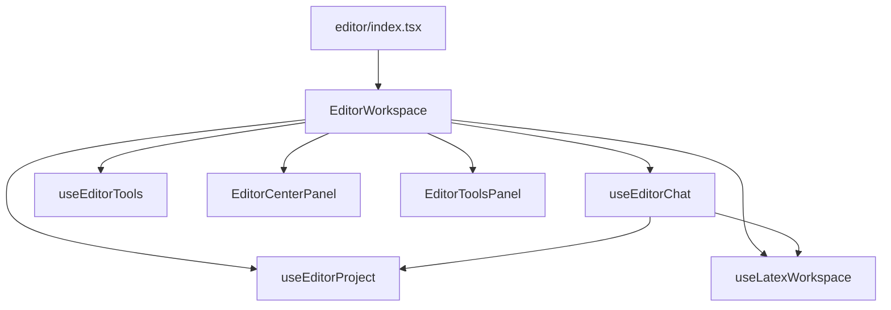

# Editor.tsx refactor plan

`frontend/src/routes/editor.tsx` is ~4,100 lines — a **god component** that owns routing boot, project I/O, LaTeX history, compile/PDF, chat streaming, pending edits, tools panels, mobile layout, and share/export dialogs.

This document proposes a **low-risk, incremental split** that does not change behavior. Each phase should be a small PR with existing manual QA (chat send, Accept/Reject, compile, multi-file).

---

## Current structure (line ranges approximate)

| Block | Lines | Responsibility |
|-------|------:|------------------|
| Types + pure helpers | 1–400 | `PendingEdit`, stats, thread storage helpers |
| `EditorPage` | 402–2500 | All state, effects, handlers, layout orchestration |
| `ArionearMasthead` | 2508–2560 | Top bar |
| Mobile components | 2564–2900 | `MobileHeader`, tabs, files, chat sheet |
| `ChatThreadList` | 2901–3067 | Sidebar chat threads |
| `LeftSidebar` | 3068–3241 | File tree + chats |
| `LatexEditor` | 3242–3294 | Thin wrapper around code editor |
| `CenterPanel` | 3295–3690 | Editor + chat dock + pending edits panel |
| `ToolsPanel` | 3692–4028 | Logic, citations, structure, versions |
| `StatusBar` + `IconBtn` | 4030+ | Footer chrome |

**Smell:** `EditorPage` holds 50+ `useState` hooks and passes 30–40 props into `CenterPanel`.

---

## Target architecture

```
frontend/src/features/editor/
  EditorWorkspace.tsx       # Main state + layout orchestration
  types.ts
  lib/
    editor-thread-storage.ts
    editor-project-stats.ts
    editor-inline-suggestion.ts
    editor-sidebar-prefs.ts
  components/
    ArionearMasthead.tsx
    CenterPanel.tsx
    ToolsPanel.tsx
    LeftSidebar.tsx
    ...mobile + chat components

frontend/src/routes/editor.tsx   # Route only (~30 lines) — exports Route for TanStack Router
```

**Rule:** hooks return `{ state, actions }`; components receive grouped props, not 40 flat fields.

---

## Phase plan (recommended order)

### Phase 1 + 3 — DONE (2026-07-02)

- Pure libs extracted to `frontend/src/features/editor/lib/`
- Presentational components split to `frontend/src/features/editor/components/`
- `EditorWorkspace.tsx` holds orchestration; `routes/editor.tsx` is route-only
- Modules live under `features/editor/` (not `routes/`) to avoid TanStack Router treating them as routes

### Phase 2 — `useEditorChat` hook — DONE (2026-07-02)

Extracted to `frontend/src/features/editor/state/useEditorChat.ts`:
- `messages`, `chatThreads`, `chatInput`, `chatLoading`, `streamProgress`
- `handleSend`, `handleStopChat`, `queueChatFollowUp`, `openChatPanel`
- `pendingEdits`, `pendingSuggestion`, accept/reject handlers
- `chatSelectionContext`, `chatComposerMode`
- Memoized `chatProps` for fewer child re-renders
- `lib/editor-edit-apply.ts` — pure `applySingleEdit`
- i18n: `editor-i18n.chatStream` (processing, stopped, accept/reject hints)

`EditorWorkspace.tsx` now wires the hook + keeps selection/jump/compile orchestration.

**Verify:** `npm run build` ✅ · `test_editor_agent` 16 passed · `test_agent_latex` 6 passed

### Phase 3 — Split layout components — DONE (merged with Phase 1)

### Phase 4 — `useEditorProject` + `useLatexWorkspace`
**Risk: medium · 2 days**

- Project boot, `projectFiles`, `activeFile`, `mainFile`, upload/import
- Compile, PDF, synctex, auto-compile

Chat hook depends on `mainLatexSource` and `latex` via parameters — avoid circular imports.

### Phase 5 — Route slim entry
**Risk: low · 0.5 day**

`routes/editor.tsx` only:
```tsx
export const Route = createFileRoute(...)({ component: EditorWorkspace });
```

TanStack Router tree unchanged.

---

## What NOT to do in the first split

- Do not introduce global state (Zustand/Redux) unless profiling shows prop-drilling pain — hooks + context per workspace is enough.
- Do not merge chat and compile into one mega-hook — keeps testability.
- Do not rewrite `ChatOverlay` — it is already a separate module.

---

## Success metrics

| Metric | Now | Target after Phase 3 |
|--------|-----|----------------------|
| `editor.tsx` lines | ~4100 | < 800 (workspace shell) |
| Largest component | `EditorPage` | < 400 lines |
| FE tests for chat/edit | 2 lib tests | + hook tests with MSW for `/chat/stream` |
| Props into center panel | ~45 | < 15 (grouped objects) |

---

## Dependency graph (after refactor)



---

## Immediate wins already done (this sprint)

- Multi-file: `active_file_content` + BE `resolve_latex_sources`
- Stale edit guard: `pending-edit-utils.ts`
- i18n: `editor-i18n.pendingEdits`, `chat-commands-i18n.ts`, BE `stream_i18n.py`

Next split should start with **Phase 1** (pure libs) — smallest diff, unblocks Phase 2.
