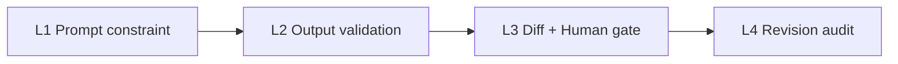

# Guardrails — Proofline

Proofline implements a **4-layer guardrail stack** so AI assists expression without silently changing scientific meaning. Every layer is active in production on Cloud Run.

**Eval evidence:** [`EVALUATION.md`](../EVALUATION.md) · [`eval/results/gate3_summary.md`](../eval/results/gate3_summary.md)

## Overview



| Layer | Mechanism | Location | User-visible? |
|-------|-----------|----------|---------------|
| **L1** | System prompts forbid inventing data, citations, results | `src/prompts/prompts.default.yaml` | No |
| **L2** | Numeric drift, semantic check, scope validator, output sanitize | `src/services/guardrails/`, `edit_executor.py` | Warning/error flags in UI |
| **L3** | All edits shown as diff; Accept/Reject required | `frontend/src/routes/editor.tsx`, `inline-suggestion.ts`, `suggestion-panel.tsx` | Yes |
| **L4** | Revision history + Accept/Reject audit in PostgreSQL | `src/db/paper_repository.py` → `suggestions` table | Tools → Versions |

### Supplementary controls (not a separate layer)

| Control | Purpose | Location |
|---------|---------|----------|
| **Logic audit** | Comment-only review — never rewrites manuscript | `prompts.default.yaml` (`logic` stage) |
| **Paid model gate** | Disable chat input when a paid LLM is selected | `frontend` — `llm-model-tier.ts`, `chat-overlay.tsx` |
| **Edit scope planner** | Prefer `\title`, section, selection over whole document | `src/services/edit_planner.py` |

---

## L1 — Prompt constraint

Every agent stage (`style`, `edit`, `logic`, `debate_roles`, `edit_planner`, `paper_ide`) includes an **INTEGRITY GUARD** block:

- Do **not** invent numbers, experimental results, datasets, or citations
- Do **not** change factual/numeric content unless the user explicitly requests it
- Logic audit: **comment only** — no rewritten manuscript
- Edit planner: prefer narrow scope (`\title`, section, selection) over whole document

**File:** `src/prompts/prompts.default.yaml` (see `paper_ide.system`, `style.system`, `edit.system`, `logic.system`).

---

## L2 — Output validation

### Integrity strictness

Configured per user profile / request (`relaxed` | `standard` | `strict`). Default: **`standard`**.

| Strictness | Numeric drift (selection) | Numeric drift (document) | Blocks Accept? |
|------------|---------------------------|--------------------------|----------------|
| `relaxed` | warning | skipped | only on `severity=error` |
| `standard` | warning | skipped | only on `severity=error` |
| `strict` | error if new numbers | warning (≤3 new) | yes when error flags |

Backend skips creating a revision record when `has_blocking_flags()` is true (`academic_nodes.py`).

### Integrity checks (`guardrails/integrity.py`)

| Check | Trigger | Typical severity (`standard`) |
|-------|---------|------------------------------|
| `numeric_drift` | New/changed numbers in snippet | warning |
| `numeric_removed` | Numbers dropped from snippet | warning |
| `semantic_drift` | Low similarity vs original (when threshold set) | warning / error in strict |
| `length_expansion` | Suggestion > 2.5× original length | warning |

### Edit scope validator (`edit_executor.validate_proposed_edit`)

Blocks unsafe edits **before** they reach the UI:

- Title-related query + `document` scope → rejected
- LaTeX command span > 15% of file → rejected
- LaTeX command block > 4000 chars → rejected
- Full `\documentclass` / `\begin{document}` leaked into selection replacement → rejected

### Output sanitize (`guardrails/output_sanitize.py`)

- Strips markdown commentary, meta lines (“Đã chỉnh sửa…”, bullet lists)
- `clamp_selection_replacement()` prevents full-document leakage for small selections

---

## L3 — Differential display (Human gate)

1. User asks Nib to edit (chat or Quick Edit)
2. Backend returns `original_text`, `replacement_text`, `selection_start/end`, `integrity_flags`
3. Editor shows **inline diff** (red delete / green insert) via `inline-suggestion.ts`
4. `SuggestionPanel` shows flags; **Accept is disabled** when any flag has `severity=error`
5. User **Accept** or **Reject** — no silent overwrite of `main.tex`

Keyboard: **Ctrl+Enter** Accept · **Esc** Reject

---

## L4 — Revision audit

On every AI edit proposal (when not blocked by L2 errors):

1. Backend stores a pending revision in PostgreSQL (`suggestions` table via `DatabaseSessionStore`)
2. User Accept or Reject → `POST /api/v1/revisions/{session_id}/{revision_id}` with action `accepted` | `rejected`
3. Status updated on the suggestion record; visible under **Tools → Versions** in the editor

> **Note:** The `audit_logs` table exists in the schema for future institution features; the current audit trail uses the `suggestions` revision history.

---

## Eval evidence

```bash
# Guardrail cases (offline)
python eval/scripts/run_gate3_eval.py --skip-live

# Full production + LLM
GATE3_API_URL=https://api.proofline.example python eval/scripts/run_gate3_eval.py --live-llm

# Regression
pytest tests/test_gate3_metrics.py tests/test_services/test_academic.py -v
```

| Artefact | Content |
|----------|---------|
| `EVALUATION.md` | Test evidence (bảng TC + metrics) |
| `eval/results/gate3_report.json` | Machine-readable results |
| `eval/results/gate3_summary.md` | Benchmark metrics vs baseline (incl. guardrail) |
| `eval/datasets/gate3_guardrail_cases.json` | 4 guardrail test cases |

**Benchmark result:** `guardrail_test_pass_rate` = **1.00** (4/4 cases)

### Verified cases

| ID | Case | Expected | Result |
|----|------|----------|--------|
| GR-01 | `92.4` → `95.0` in snippet | `numeric_drift` flag | ✅ |
| GR-02 | Paraphrase keeping `92.4%` | No flag | ✅ |
| GR-03 | “sửa tiêu đề” + document scope plan | Validator blocks | ✅ |
| GR-04 | “Đổi tên đề tài … EfficientNetV3” | Target `\title{...}` only | ✅ |

---

## Production notes

- `APP_ENV=production` on Cloud Run (`asia-east1`)
- CORS locked to frontend URL (`proofline.example`)
- LLM API keys only on server (GCP Secret Manager) — never in browser
- Integrity strictness persisted in user profile settings
