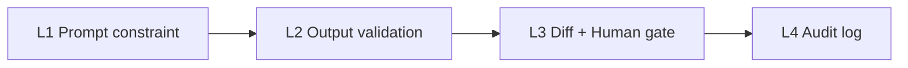

# Guardrails — Arionear (Gate 3)

Arionear implements a **4-layer guardrail stack** so AI assists expression without silently changing scientific meaning. Every layer is active in production.

## Overview



| Layer | Mechanism | Location | User-visible? |
|-------|-----------|----------|---------------|
| **L1** | System prompts forbid inventing data, citations, results | `src/prompts/prompts.default.yaml` | No |
| **L2** | Numeric drift, semantic length, scope validator, output sanitize | `src/services/guardrails/`, `edit_executor.py` | Warning flags in UI |
| **L3** | All edits shown as diff; Accept/Reject required | `frontend/src/routes/editor.tsx`, `inline-suggestion.ts` | Yes |
| **L4** | Revision history + audit on Accept/Reject | `session_store`, PostgreSQL `papers` | Tools → Versions |

---

## L1 — Prompt constraint

Every agent stage (`style`, `edit`, `logic`, `debate_roles`, `edit_planner`) includes explicit prohibitions:

- Do not add numbers, experimental results, or citations not in the source
- Logic audit: **comment only** — no rewritten manuscript
- Edit planner: prefer narrow scope (`\title`, section) over whole document

---

## L2 — Output validation

### Integrity checks (`guardrails/integrity.py`)

| Check | Trigger | Severity |
|-------|---------|----------|
| `numeric_drift` | New/changed numbers in selection edits | warning |
| `numeric_removed` | Numbers dropped from snippet | warning |
| `semantic_drift` | Suggestion too short vs original (strict mode) | error (blocks) |
| `length_explosion` | Suggestion much longer than scope | warning |

### Edit scope validator (`edit_executor.validate_proposed_edit`)

Blocks unsafe edits before they reach the UI:

- Title-related query + `document` scope → rejected
- LaTeX command span too large → rejected
- Full `\documentclass` leaked into selection replacement → rejected

### Output sanitize (`guardrails/output_sanitize.py`)

Strips LLM commentary and clamps full-document leakage when the target is a small selection.

---

## L3 — Differential display (Human gate)

1. User asks Ario to edit
2. Backend returns `original_text`, `replacement_text`, `selection_start/end`
3. Editor shows inline diff (red delete / green insert)
4. User **Accept** or **Reject** — no silent overwrite

---

## L4 — Audit log

On Accept:

- `POST /api/v1/revisions/{session_id}/{revision_id}` records action
- Paper metadata stores revision history
- Enables AI contribution disclosure (Phase 3 export)

---

## Eval evidence

Run the Gate 3 eval harness:

```bash
python eval/scripts/run_gate3_eval.py
pytest tests/test_gate3_metrics.py -v
```

See `eval/results/gate3_report.json` and `REPORT_GATE3.md`.

### Example blocked cases

| Case | Input | Expected |
|------|-------|----------|
| Numeric drift | `92.4` → `95.0` in abstract | Integrity flag |
| Title scope | “sửa tiêu đề” + document plan | Validator blocks |
| Title OK | “Đổi tên đề tài … EfficientNetV3” | Targets `\title{...}` only |

---

## Production notes

- `APP_ENV=production` on Cloud Run
- CORS locked to frontend URL
- Compile runs in Docker image with TeX Live (consistent PDF output)
- LLM keys only on server — never exposed to browser
