# Architecture Diagram — Arionear

**Dự án:** Arionear · *Closer to Publication*  
**Cập nhật:** 26/06/2026 · Đồng bộ Phase 2 (`develop` @ defense + templates + paper score)  
**Live:** [https://arionear-web-345047770052.asia-east1.run.app/](https://arionear-web-345047770052.asia-east1.run.app/)

Sơ đồ bổ sung cho [ARCHITECTURE.md](../ARCHITECTURE.md). ✅ = đã triển khai · ⚠️ = một phần · *(planned)* = mục tiêu tương lai.

---

## 1. System Overview (Deployment)

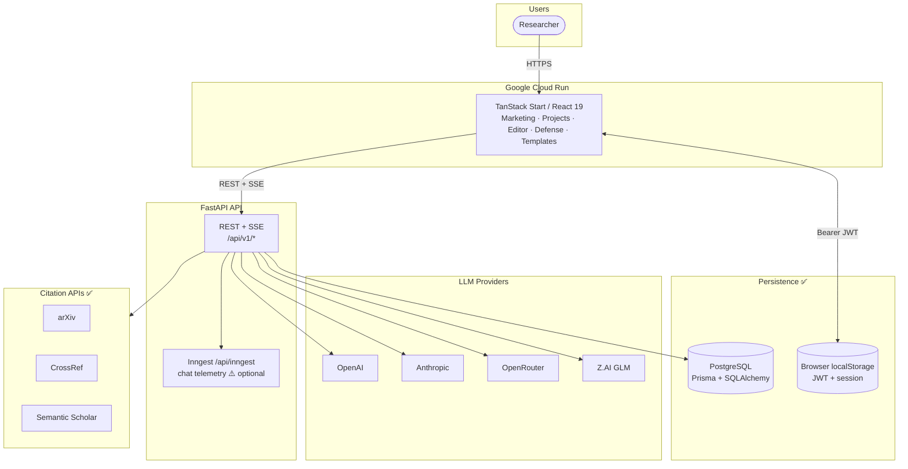

| Surface | URL / host | Ghi chú |
|---------|------------|---------|
| Frontend (prod) | `arionear-web-*.asia-east1.run.app` | Nitro `node-server`, Docker |
| Backend API | Configured `VITE_API_URL` / proxy | FastAPI + TeX compile |
| Database | `DIRECT_DATABASE_URL` | Papers, auth, profiles, templates |

---

## 2. Four-Layer Product Architecture

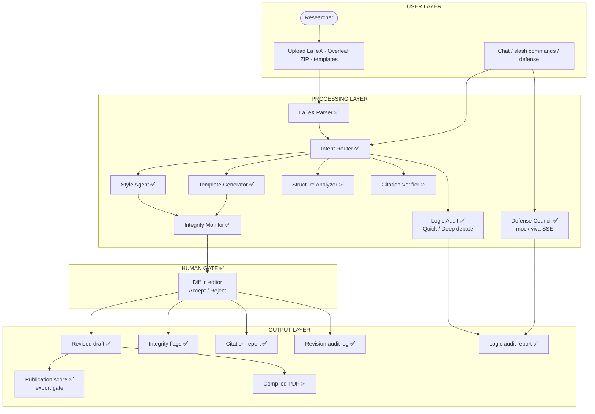

---

## 3. Frontend Routes & Components

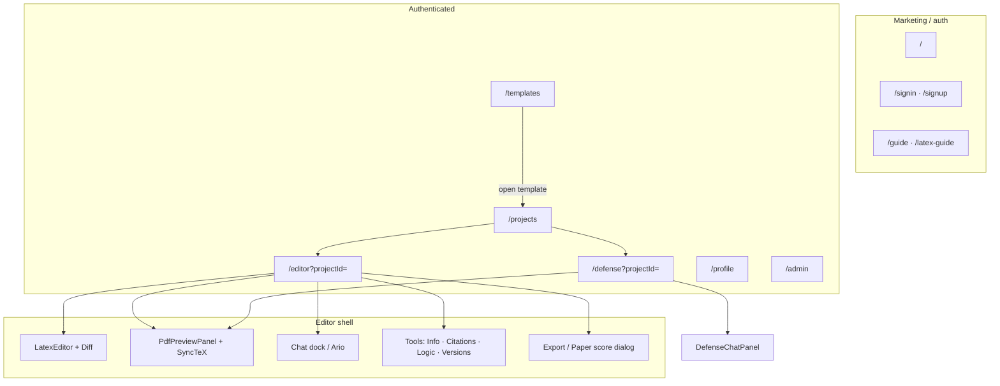

---

## 4. Backend API Surface

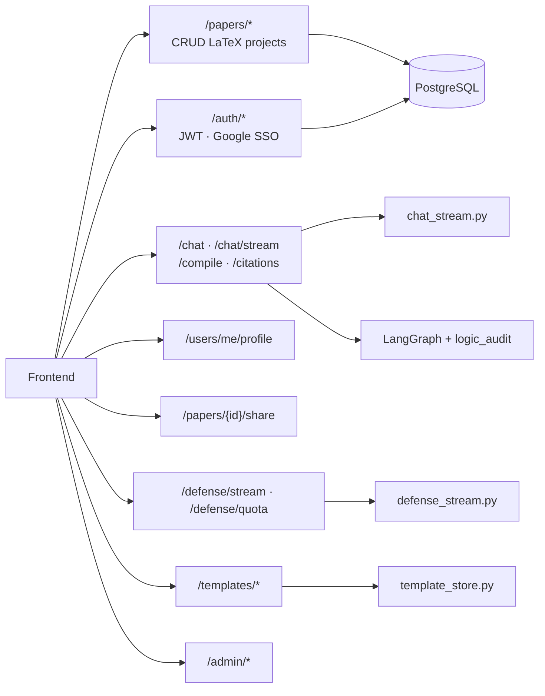

---

## 5. LangGraph Agent Flow (sync `/chat`)

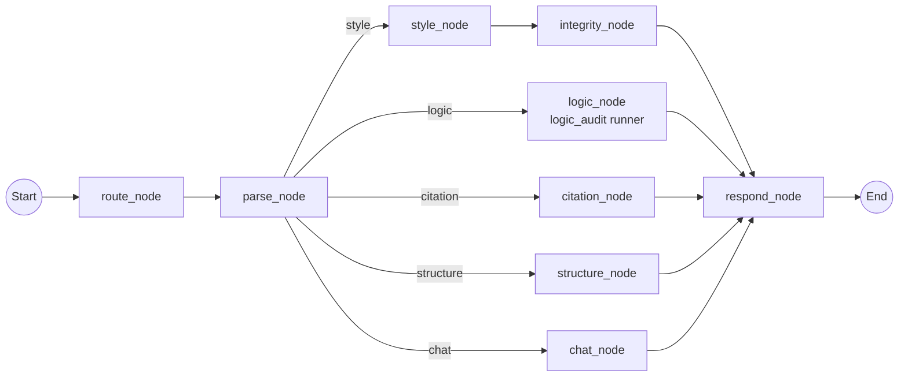

| Node | Module |
|------|--------|
| `logic_node` | `services/logic_audit/runner.py` + `debate.py` |
| `style_node` | `guardrails/integrity.py` + LLM |
| `citation_node` | `services/citations/verifier.py` |
| Stream-only `template` | `chat_stream.py` + `template_latex.py` |

---

## 6. SSE — Editor Chat (`/chat/stream`)

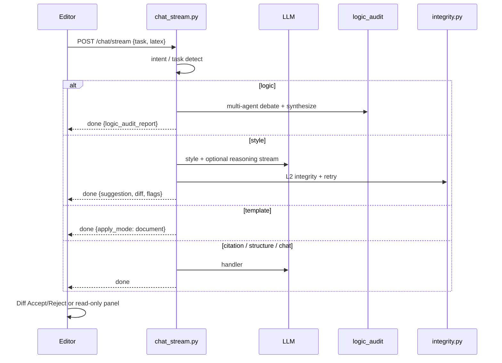

---

## 7. Defense Mode (`/defense/stream`)

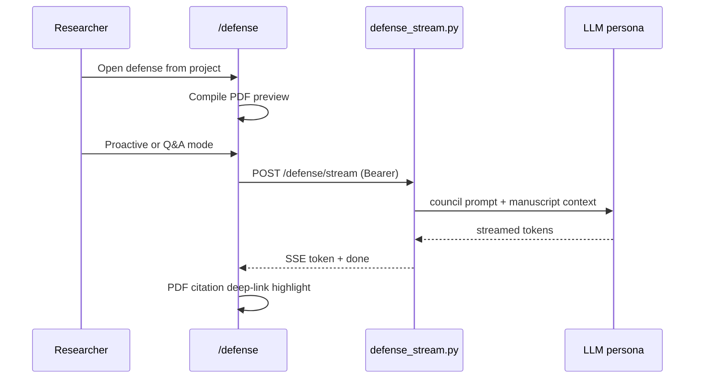

---

## 8. Publication Score & Export Gate

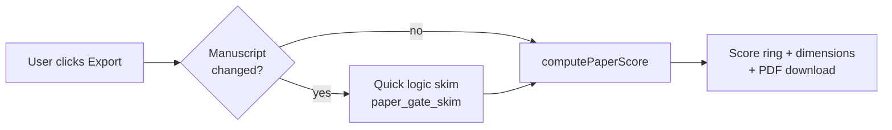

Dimensions: structure, completeness, citations, compile health, peer-review signals from logic audit.

---

## 9. Template Gallery

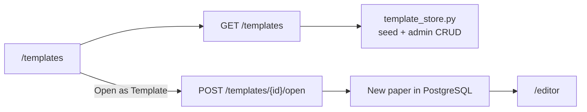

---

## 10. Guardrail & Auth

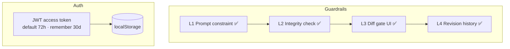

---

## 11. Citation Verifier (layers 1–3 ✅)

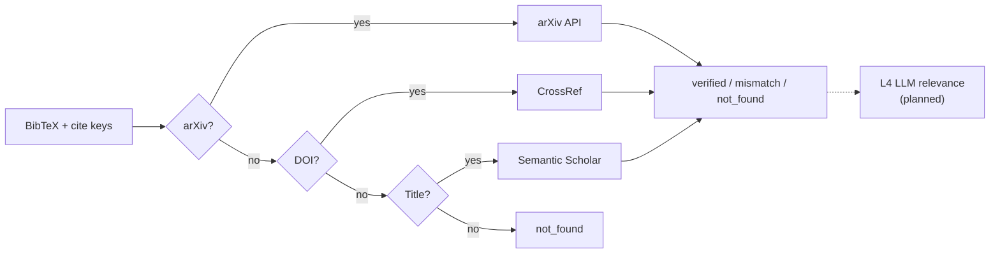

---

## 12. Component Reference

| Component | Technology | Purpose | Status |
|-----------|-----------|---------|--------|
| Frontend | TanStack Start, React 19, Tailwind v4 | Editor, defense, templates, marketing | ✅ |
| Deploy | Cloud Run + frontend Dockerfile | Live URL | ✅ |
| Backend | FastAPI, Pydantic | REST + SSE | ✅ |
| Agent | LangGraph `graph.py` | style, structure, citation, logic, chat | ✅ |
| Stream | `chat_stream.py`, `defense_stream.py` | Editor + defense SSE | ✅ |
| Logic audit | `services/logic_audit/*` | Multi-agent comment-only review | ✅ |
| Paper score | `lib/paper-score.ts` + gate skim | Export readiness dialog | ✅ |
| Templates | `template_store.py`, `template_routes.py` | Gallery + open as project | ✅ |
| Defense | `defense_stream.py`, `defense_citations.py` | Mock viva + PDF links | ✅ |
| LLM | OpenAI / Anthropic / OpenRouter / Z.AI | Inference | ✅ |
| Database | PostgreSQL, Prisma, SQLAlchemy | Papers, auth, profiles, templates | ✅ |
| Auth | JWT + Google OAuth | Sign-in, 3-day default session | ✅ |
| Admin | `admin_routes.py` | Users, LLM policy, quotas | ✅ |
| Inngest | `inngest/` + hooks | Chat telemetry (optional) | ⚠️ |
| Citation L4 LLM | — | Relevance layer | *(planned)* |
| DOCX/PDF import | — | Non-LaTeX ingest | *(planned)* |

---

## Tài liệu liên quan

- [ARCHITECTURE.md](../ARCHITECTURE.md) — mô tả chi tiết kiến trúc
- [README.md](../README.md) — setup & Live URL
- [AutoResearchReferee.md](../AutoResearchReferee.md) — ARC adopt/adapt/drop
- [pdf-preview-deploy.md](./pdf-preview-deploy.md) — TeX & Docker ops
