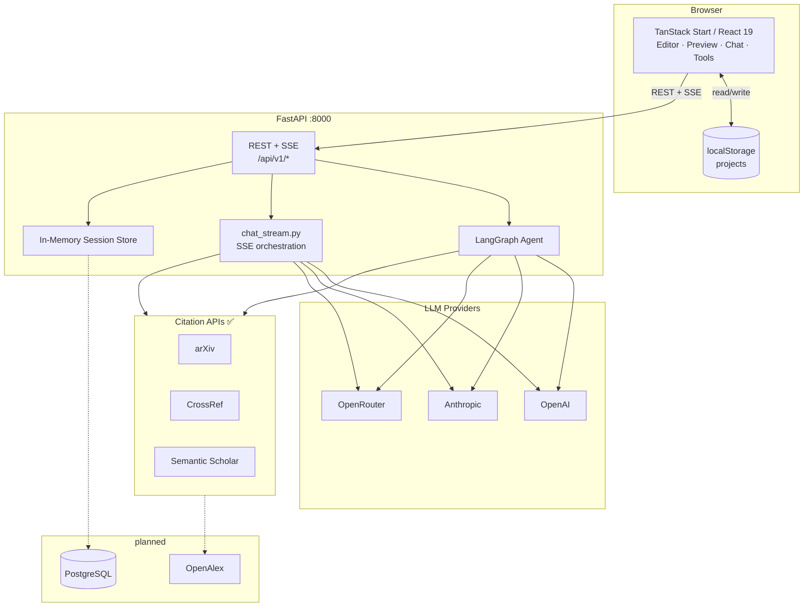
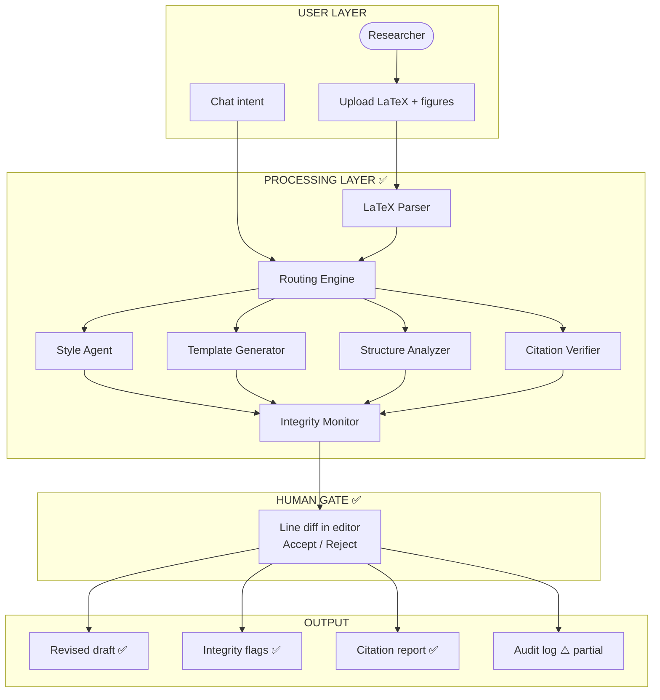
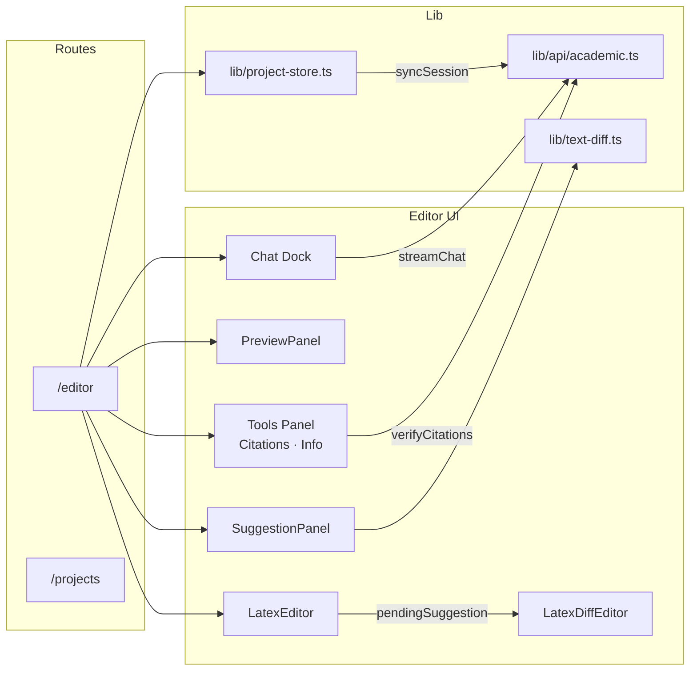
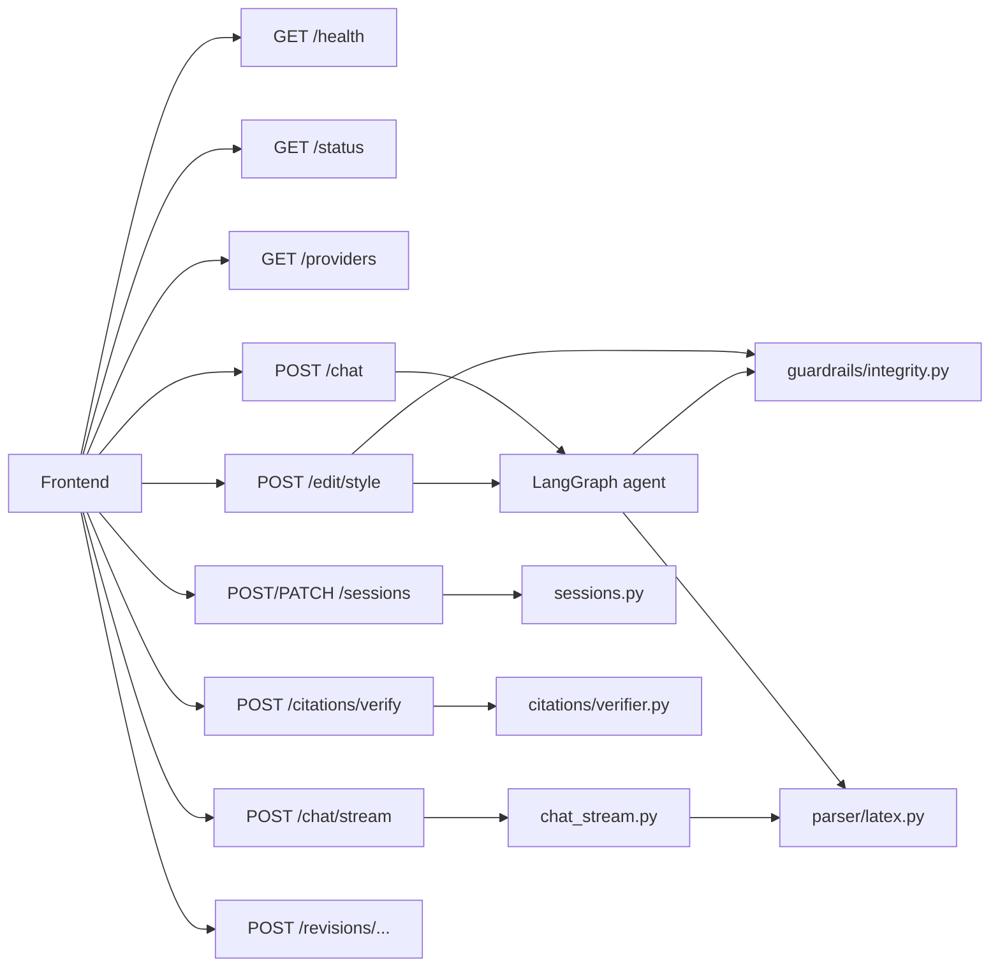
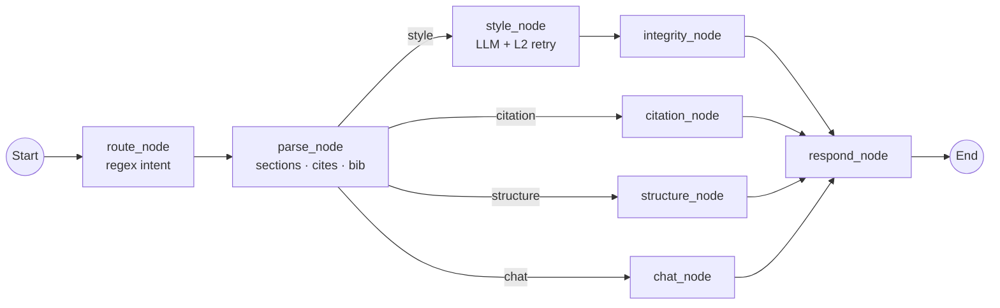
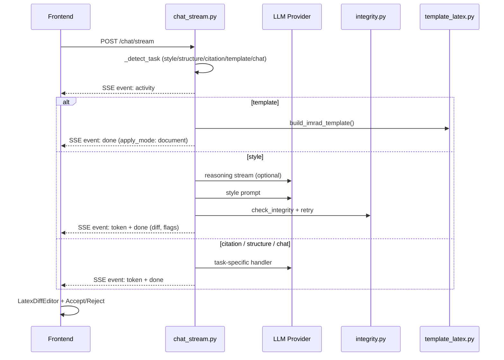
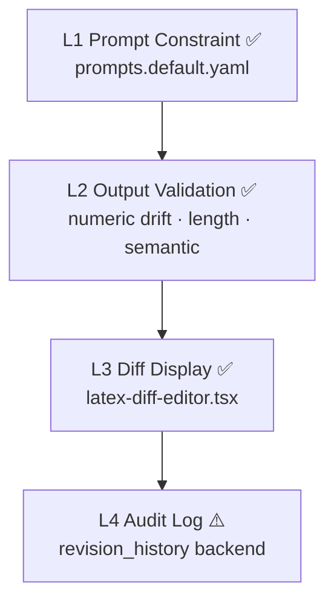
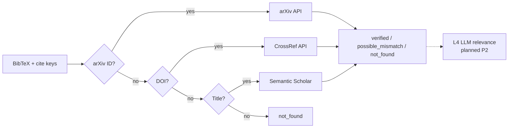
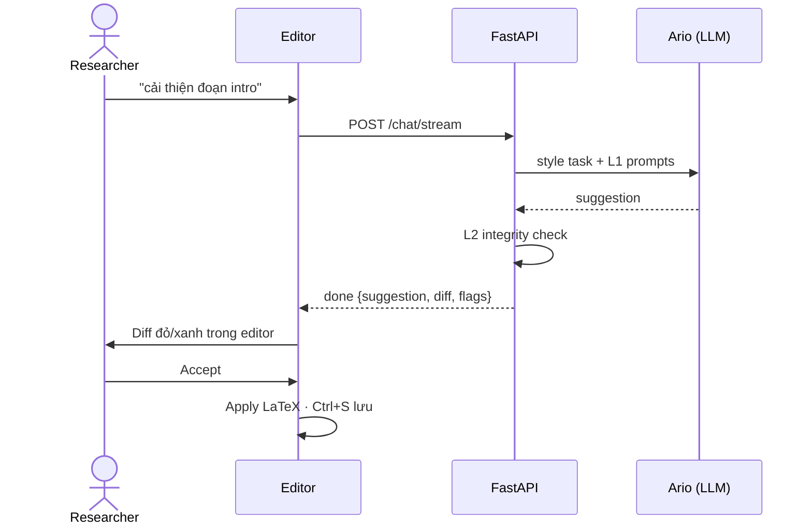

# Architecture Diagram — Arionear

**Dự án:** Arionear · *Closer to Publication*  
**Cập nhật:** 13/06/2026 · Đồng bộ với [ARCHITECTURE.md](../ARCHITECTURE.md) v2.1

Sơ đồ bổ sung cho tài liệu kiến trúc chính. ✅ = Phase 1 MVP đã code · *(planned)* = mục tiêu tương lai.

---

## 1. System Overview (Deployment)

---

## 2. Four-Layer Product Architecture

---

## 3. Frontend Component Map

---

## 4. Backend API Surface

---

## 5. LangGraph Agent Flow (sync `/chat`)

| Node | Module |
|------|--------|
| `route_node` | `agents/nodes/academic_nodes.py` |
| `parse_node` | `services/parser/latex.py` |
| `style_node` | `prompts.default.yaml` + `guardrails/integrity.py` |
| `citation_node` | `services/citations/verifier.py` |
| `structure_node` | `parser/latex.py` + LLM |
| `chat_node` | Ario general chat |

---

## 6. SSE Stream Flow (`/chat/stream`)

Luồng chính của editor. Task **template** (IMRAD skeleton) chỉ chạy ở đây.

---

## 7. Guardrail Layers

---

## 8. Citation Verifier (4-layer, layers 1–3 ✅)

---

## 9. Chat → Human Gate (End-to-End)

---

## 10. Component Reference

| Component | Technology | Purpose | Status |
|-----------|-----------|---------|--------|
| Frontend | TanStack Start, React 19, shadcn/ui, Tailwind v4 | Editor, preview, chat, tools | ✅ |
| API client | `frontend/src/lib/api/academic.ts` | REST + SSE | ✅ |
| Backend | FastAPI, Pydantic | API server | ✅ |
| Agent | LangGraph (`src/agents/graph.py`) | Multi-task orchestration | ✅ |
| Stream service | `src/services/chat_stream.py` | SSE + template path | ✅ |
| LLM | OpenAI / Anthropic / OpenRouter | Inference | ✅ |
| Prompts | `src/prompts/prompts.default.yaml` | C9 external prompts | ✅ |
| Parser | `src/services/parser/latex.py` | Sections, cites, BibTeX | ✅ |
| Guardrails | `src/services/guardrails/integrity.py` | L2 validation | ✅ |
| Citations | `src/services/citations/verifier.py` | arXiv → CrossRef → S2 | ✅ |
| Session store | `sessions.py` + localStorage | Paper state MVP | ✅ |
| Database | PostgreSQL / SQLite | Persistent storage | *(planned)* |
| Logic / Review agents | LangGraph nodes | Debate & reply drafts | *(planned P2)* |
| Vector / RAG store | — | Not used (ARC C1 adapted to verifier only) | — |

---

## Tài liệu liên quan

- [ARCHITECTURE.md](../ARCHITECTURE.md) — mô tả đầy đủ kiến trúc & trạng thái triển khai
- [AutoResearchReferee.md](../AutoResearchReferee.md) — phân tích ARC adopt/adapt/drop
